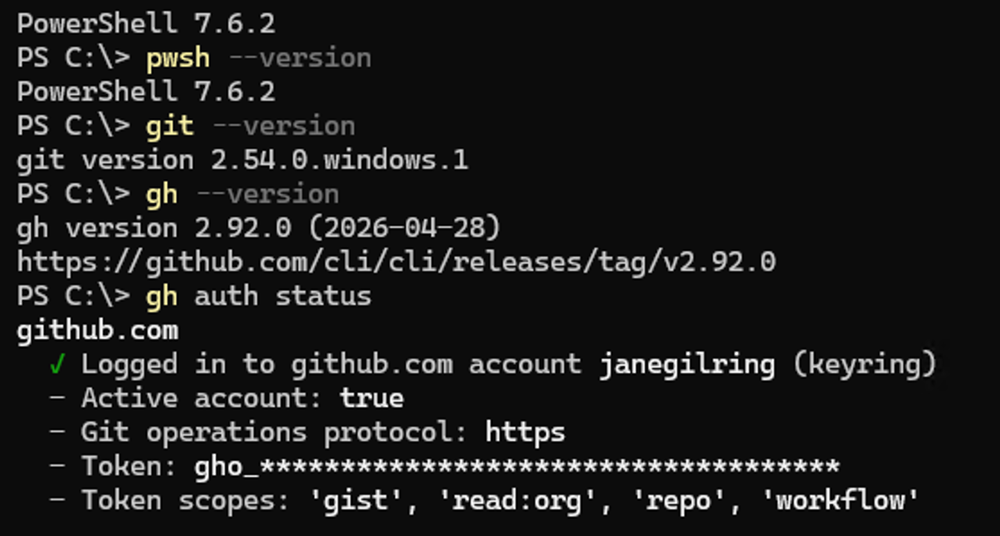
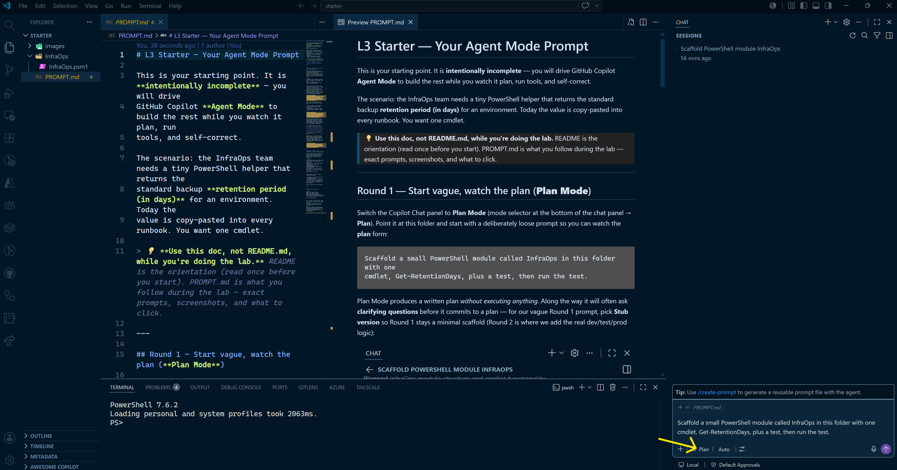
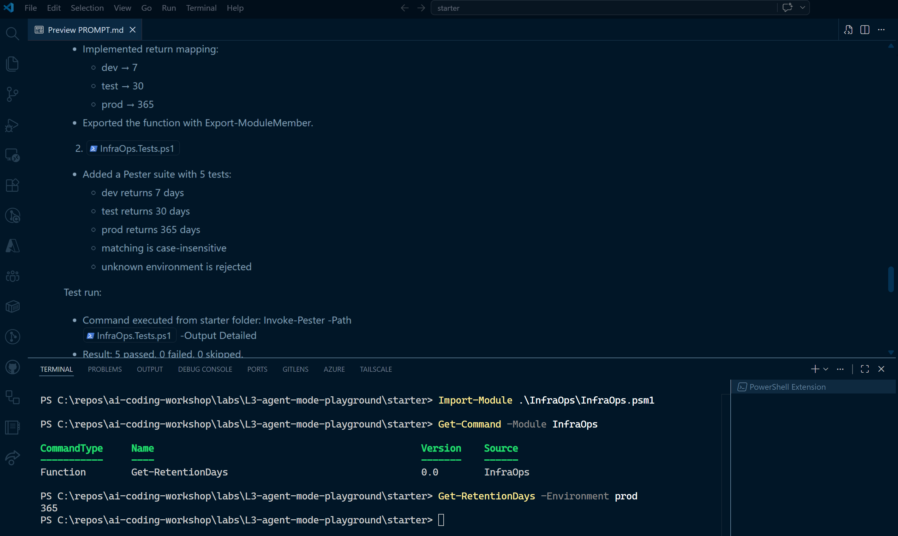
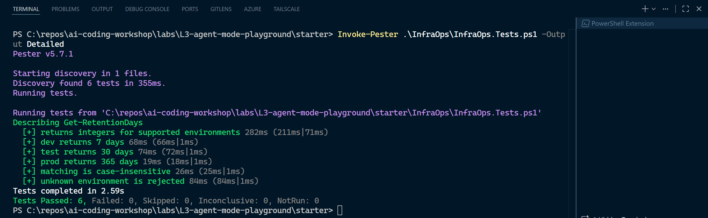

# L3 — Agent Mode Playground · Autonomous Tasks

**Format:** Hands-on lab (agent-driven build)
**Core time:** 25 minutes
**Goal:** Use GitHub Copilot Agent Mode to scaffold a tiny PowerShell module, and observe the multi-step iteration loop — plan, tool calls, self-correction, and steering — for the first time yourself.

L3 is your first time **driving** agent mode. In Module 10 — Agent Mode Deep Dive you watched the loop. Here you run it: you give direction, the agent plans and executes, and you decide when to interrupt and when to let it run.

> *The function is intentionally tiny — the skill you're practicing is observing **plan → execute → review → steer**, not writing the cmdlet. The stretch tracks add depth if you finish early.*

---

## What this lab teaches

> **Agent mode is not a one-shot prompt. It is a loop: you prompt, it plans, you observe, it executes, it reviews, you steer — and repeat.**

This is the exact loop from M10 (Prompt → Plan → Observe → Execute → Review → Steer). The success of L3 is **not** the finished module — it is that you saw the agent plan multiple steps, call tools (file edits and a terminal run), read a result, and correct itself while you steered.

This is **vanilla** agent mode — file operations, terminal, basic tools. No MCP, no custom instructions. That comes in L4.

---

## How to use it

### Pick your mode at a glance

| Mode | Use when | Path | Debrief | Stretch |
| --- | --- | --- | --- | --- |
| **Core · 25 min** | You are running the standard L3 slot | Setup → Round 1 → Round 2 → debrief | Yes, 3 min | No |
| **Stretch · +10–15 min** | A pair finishes early or the window is longer | Core + one stretch task | Yes | Yes |

### Core path — 25 minutes

1. Give the 1-minute frame: same loop you saw in M10, now you drive it.
2. Run **Setup validation** (~6 min) so agent mode and the terminal both work.
3. Run **Round 1**: start vague, read the plan, watch the tool calls.
4. Run **Round 2**: steer with the real requirements, watch it run the test and self-correct.
5. Debrief for ~3 minutes: when did you steer, when did you let it run?

---

## Agent-mode philosophy

You own the **steering wheel**; the agent owns the **typing and the testing**.

The two skills you are practicing:

- **Observe before approving.** A plan is a chance to catch drift early. Read it. Reject or edit it if the scope or approach is wrong.
- **Steer, don't micromanage.** Once the plan is solid and the task is well-scoped, let the loop run — including its own error → fix → re-run cycles. Interrupt only when it veers (wrong scope, files outside the target, a standards violation).

If you tell the agent *what* and *within which boundaries*, it handles the *how*. Vague prompts produce vague results at agent scale — be specific about the task and the scope.

---

## The scenario

The InfraOps team copies the same backup **retention period** into every runbook
by hand. You want one small cmdlet, `Get-RetentionDays`, that returns the
standard retention in days for an environment:

| Environment | Retention |
| --- | --- |
| `dev` | 7 days |
| `test` | 30 days |
| `prod` | 365 days |

Synthetic and small on purpose — the learning target is the **loop**, not the code.

---

## Round-by-round overview

| Round | Title | Framing |
| --- | --- | --- |
| 1 | **Start vague — watch the plan** | Give a loose prompt and observe how the agent decomposes it into steps and tool calls. |
| 2 | **Steer — watch it self-correct** | Add the real contract and constraints; watch the agent run the test, read failures, and fix them. |

---

## Core path — 25 minutes

### 0:00–0:06 — Setup validation

Open PowerShell 7 in the repository root and confirm your tools:

```powershell
pwsh --version
git --version
gh --version
gh auth status
```

**Expected output** (versions will vary; what matters is that all four commands succeed and `gh auth status` shows you're logged in with `repo`, `read:org`, `workflow` scopes):



Then confirm **Pester 5+** is installed (Agent Mode usually generates Pester-based tests; pwsh 7 does not ship with Pester):

```powershell
(Get-Module -ListAvailable Pester | Sort-Object Version -Descending | Select-Object -First 1).Version
```

If the version is empty or lower than `5.0.0`, install it (one-time, per user):

```powershell
Install-PSResource -Name Pester -TrustRepository
```

Open the lab in VS Code with the **`starter/` folder** as your workspace:

```powershell
code labs\L3-agent-mode-playground\starter
```

> ⚠️ Open `starter/`, **not** the parent `labs/L3-agent-mode-playground/` folder. The `solution/` reference build lives in the parent — keeping it outside your workspace stops Agent Mode from peeking at the answer and turning Round 2 into a no-op.

### 0:06–0:22 — Run the rounds (follow `starter/PROMPT.md`)

Open `starter/PROMPT.md` and click **Open Preview to the Side** (the split-pane icon in the top-right of the editor tab, or `Ctrl+K V`) so you can read the rendered prompts beside the Copilot Chat panel.



*Recommended layout: source on the left, rendered preview in the middle, Copilot Chat on the right with **Plan** selected in the mode selector for Round 1.*

> 💡 **On a secondary screen?** You can also view `starter/PROMPT.md` directly on github.com (browse to the repo → `labs/L3-agent-mode-playground/starter/PROMPT.md`) and follow it from a second monitor or browser window — frees up your VS Code window for the editor + chat panel only.

**`starter/PROMPT.md` is the doc you follow during the lab itself** — it has the exact prompts for both rounds, the screenshots of what to expect, and what to click (clarifying questions, **Start Implementation**, **Allow** for the terminal run). Come back to this README for the debrief, the observation checklist, and the stretch tasks.

The shape of each round:

| Round | Mode | What you do |
| --- | --- | --- |
| **Round 1** (~7 min) | **Plan Mode** | Loose prompt → read the plan → switch to Agent → watch file edits + the test run |
| **Round 2** (~9 min) | **Agent Mode** | Steer with the real contract → watch the agent run the test, read failures, and self-correct |

### 0:22–0:25 — Debrief

Answer for yourself or with a partner:

- When did you **steer**, and when did you **let it run**?
- Did the plan match your intent, or did you catch drift early?
- What did the agent fix without you telling it the exact change?

---

## What's in the folder

| Path | Purpose |
| --- | --- |
| `starter/PROMPT.md` | Your Round 1 and Round 2 prompts, plus what to observe |
| `starter/InfraOps/InfraOps.psm1` | Intentionally incomplete stub for the agent to build out |
| `solution/InfraOps/InfraOps.psm1` | Reference cmdlet with comment-based help |
| `solution/Run-Tests.ps1` | Framework-free fallback harness used by facilitators to validate the solution build without depending on Pester being installed |
| `solution/facilitator-notes.md` | Timing, debrief prompts, and common-stumble fixes |

The starter is **intentionally incomplete** — it is your starting point, not a bug. Let the agent fill it in.

---

## How attendees work

1. Run the **Setup validation** block above.
2. Open `starter/PROMPT.md` with the Markdown preview to the side (see the layout screenshot above) and switch the chat panel to **Plan Mode**.
3. Follow PROMPT.md for both rounds (Round 1 in Plan Mode, Round 2 in Agent Mode).
4. Compare against `solution/` — for shape and behavior, not line-by-line.

### Observation checklist

You "got it" when you can point to where the agent:

- [ ] produced a **multi-step plan** before doing anything
- [ ] made **file edits** as tool calls
- [ ] ran a **terminal command** (the test) as a tool call
- [ ] **read the result** and looped to fix a failure
- [ ] responded to your **steering** when you redirected it

---

## Self-check guidance

Do **not** diff against the solution line by line. The agent might validate the environment with a chain of `if`/`elseif` checks, a `switch` block, or a `[ValidateSet]` parameter attribute — all three are valid PowerShell. As long as the behaviour matches the spec and the tests pass, it counts.

You succeeded if:

- the test run ends with `All L3 checks passed.`
- you observed at least one full loop (plan → execute → review)
- you can describe one moment you steered and one moment you let it run

---

## Safety rules

- Use only synthetic examples from this lab. No production data or secrets.
- Do not paste customer data, production resource names, or private infrastructure details into Agent Mode.
- Read the plan and the diffs before approving — treat agent output as a draft.
- Keep the agent scoped to this lab folder; interrupt it if it tries to edit files outside it.

---

## Optional stretch

Each stretch is **another loop iteration** — add a requirement and watch the agent plan, execute, and review again.

### Stretch A — Add a safe default

Ask the agent to add an optional `-Default` switch (or `-FallbackDays` parameter)
so an unknown environment returns a safe default instead of throwing — and to add
a test for it. Watch it re-plan around the existing tests.

### Stretch B — Add a module manifest

Ask the agent to generate an `InfraOps.psd1` manifest with
`New-ModuleManifest`, wire it to the `.psm1`, and re-run the test.

### Stretch C — Verify the module yourself

Don't take the agent's word for it. From the integrated terminal (inside the `starter/` folder), drive the module by hand and re-run the tests:

```powershell
Import-Module .\InfraOps\InfraOps.psm1 -Force
Get-Command -Module InfraOps
Get-RetentionDays -Environment prod      # expect 365
Get-RetentionDays -Environment DEV       # expect 7 (case-insensitive)
Get-RetentionDays -Environment staging   # expect a parameter-validation error
Invoke-Pester .\InfraOps\InfraOps.Tests.ps1 -Output Detailed
```

You should see `Get-RetentionDays` listed as a `Function` in the `InfraOps` source, and the values return as expected:



Then Pester should end with `Tests Passed: 6, Failed: 0` (or however many the agent wrote):



This is the habit you want to carry into real agent work: the agent does the typing, **you** confirm the artifact behaves like the spec said.

---

## Theory follow-up

This lab is the simulator for **M10 — Agent Mode Deep Dive**. Revisit
`presentations/M10-agent-mode-deep-dive.html` (especially the Iteration Loop
diagram) to map what you just did back to Prompt → Plan → Observe → Execute →
Review → Steer. Next up: **L4**, where you give the agent DNV-specific context
with custom instructions and MCP tools.
