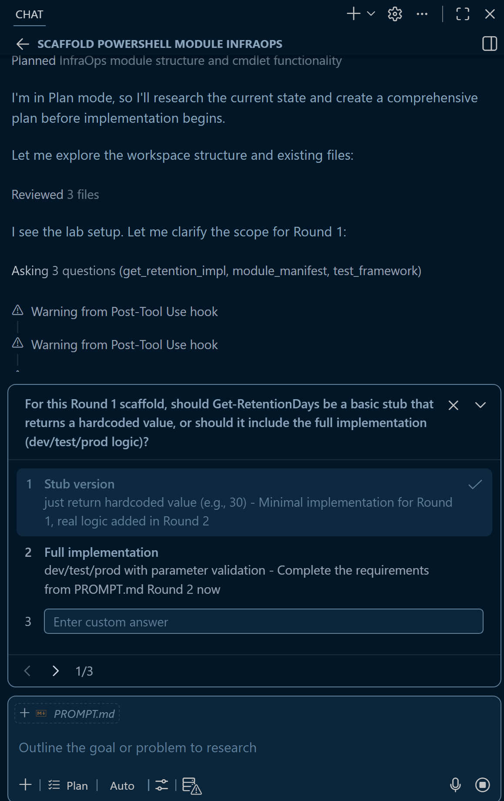
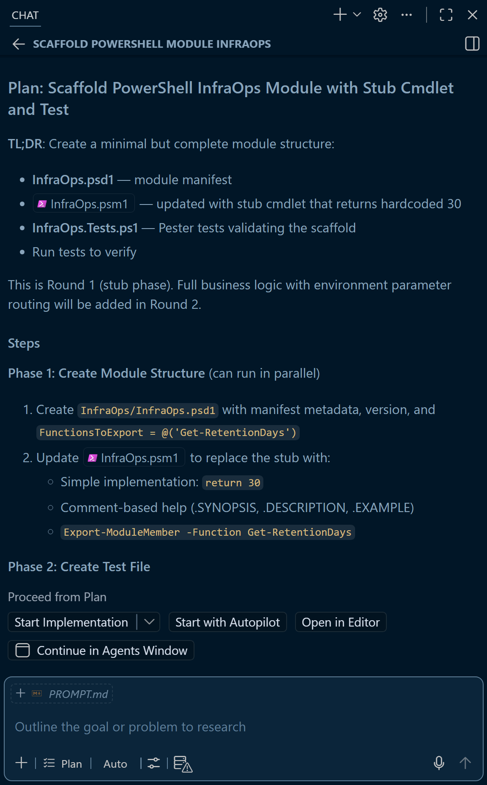
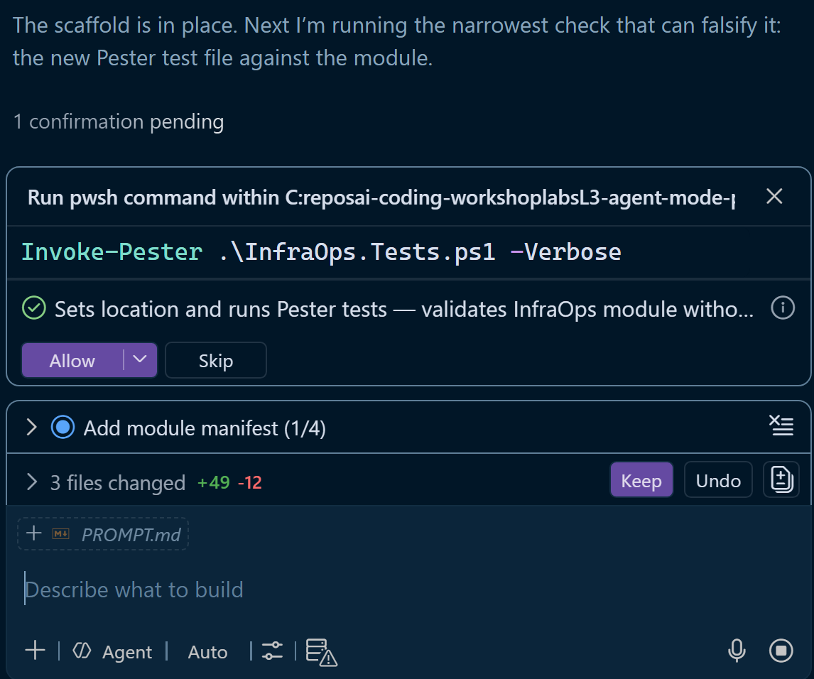
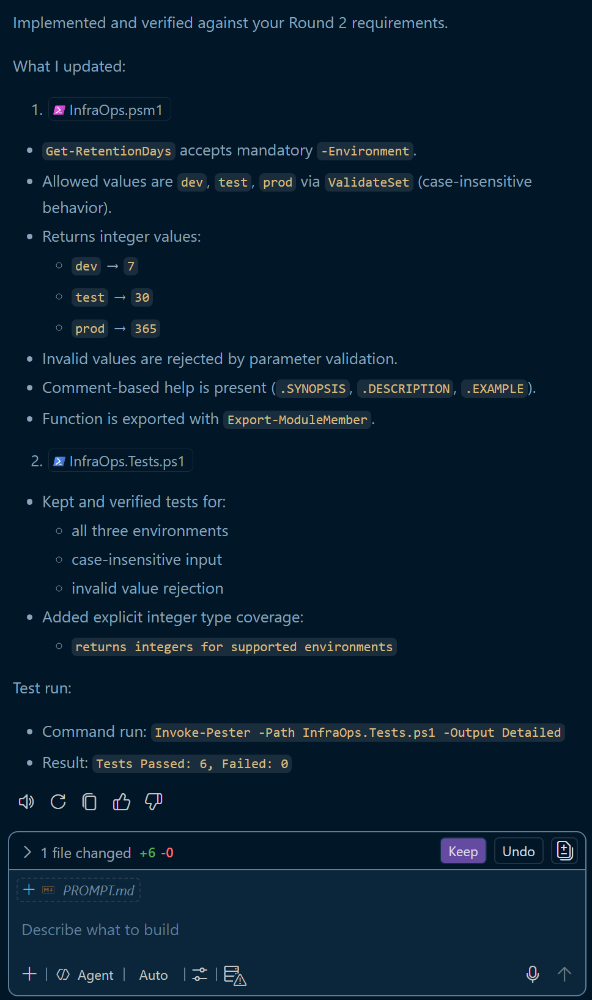

# L3 Starter — Your Agent Mode Prompt

This is your starting point. It is **intentionally incomplete** — you will drive
GitHub Copilot **Agent Mode** to build the rest while you watch it plan, run
tools, and self-correct.

The scenario: the InfraOps team needs a tiny PowerShell helper that returns the
standard backup **retention period (in days)** for an environment. Today the
value is copy-pasted into every runbook. You want one cmdlet.

> 💡 **Use this doc, not README.md, while you're doing the lab.** README is the orientation (read once before you start). PROMPT.md is what you follow during the lab — exact prompts, screenshots, and what to click.

---

## Round 1 — Start vague, watch the plan (**Plan Mode**)

Switch the Copilot Chat panel to **Plan Mode** (mode selector at the bottom of the chat panel → **Plan**). Point it at this folder and start with a deliberately loose prompt so you can watch the **plan** form:

```text
Scaffold a small PowerShell module called InfraOps in this folder with one
cmdlet, Get-RetentionDays, plus a test, then run the test.
```

Plan Mode produces a written plan *without executing anything*. Along the way it will often ask **clarifying questions** before it commits to a plan — for our vague Round 1 prompt, pick **Stub version** so Round 1 stays a minimal scaffold (Round 2 is where we add the real dev/test/prod logic):



Then **read the finished plan** before you do anything else. Look for:

- multiple steps (create module file, write the cmdlet, write a test, run it)
- which files it intends to touch
- which terminal command it intends to run



When the plan looks right, click **Start Implementation** (leftmost button under *Proceed from Plan*). It hands the plan to Agent Mode and starts executing — watch the tool calls (file edits + terminal).

> 💡 **Don't click *Start with Autopilot* for this lab.** Autopilot lets a small utility model decide when the task is done and loop up to 3 times without checking in — great for trusted, repetitive work, but here the whole point is to *watch* the loop. Stick with **Start Implementation** so you can see each step.

Agent Mode will create the files, then **pause and ask permission** before running the Pester command — file edits run silently, but terminal commands always need your **Allow**. Click **Allow** to let it run the test.



---

## Round 2 — Add the real requirements (steer) (**Agent Mode**)

Stay in **Agent Mode** for Round 2 — now the point is watching the loop execute. The vague version will guess. Steer it with the actual contract:

```text
Get-RetentionDays takes -Environment (one of: dev, test, prod) and returns an
integer: dev = 7, test = 30, prod = 365. Reject any other value. Matching must
be case-insensitive. Add comment-based help. The test must cover all three
environments, a case-insensitive case, and an invalid value. Run the test and
fix anything that fails.
```

Now watch the **Review → Steer** stages of the loop:

- The agent runs the test and reads the PASS/FAIL output.
- If something fails, it proposes a fix and re-runs — **on its own**.
- You steer only if it drifts (edits the wrong files, over-engineers, breaks scope).

> 💡 **Expect a few approvals along the way.** Agent Mode pauses for every terminal command (and occasionally for tool calls it wants to make outside the workspace). Skim what it wants to run, click **Allow** to keep the loop moving. Each `Invoke-Pester` re-run will prompt again — that's normal.

That self-correction is the heart of L3.

When the agent reports all green and the loop settles, Agent Mode shows a **"N file(s) changed"** summary at the bottom of the chat with **Keep** and **Undo** buttons. Skim the diff — the cmdlet implementation and the Pester tests — and click **Keep** to accept the edits. (Undoing would roll back every file Agent Mode wrote in this round.)



---

## What "done" looks like

```text
PASS: dev returns 7 days
PASS: test returns 30 days
PASS: prod returns 365 days
PASS: matching is case-insensitive
PASS: unknown environment is rejected

All L3 checks passed.
```

The `InfraOps/` folder next to this file holds a stub module with a TODO — let
the agent fill it in (or replace it). The reference build is in `../solution/`.

When you're done with both rounds, head back to the lab **README.md** for the debrief questions, observation checklist, and optional stretch tasks.

