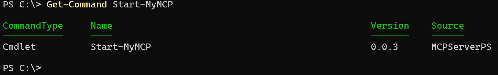
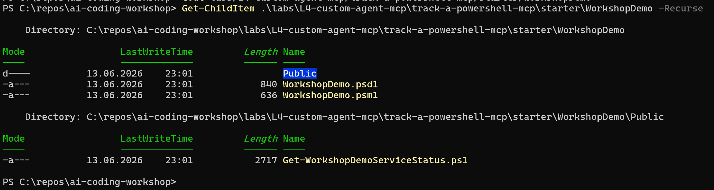
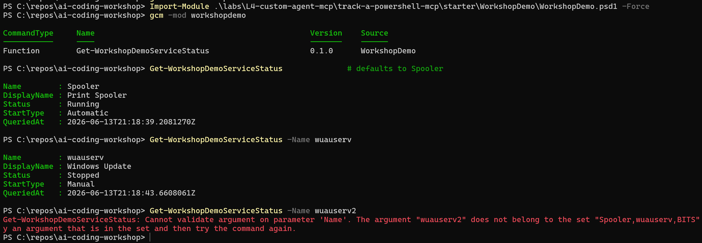
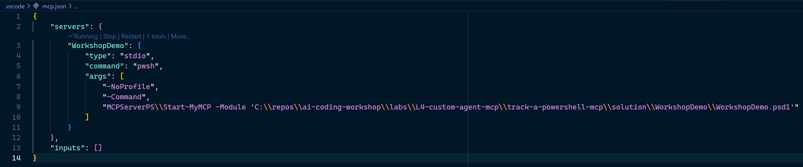
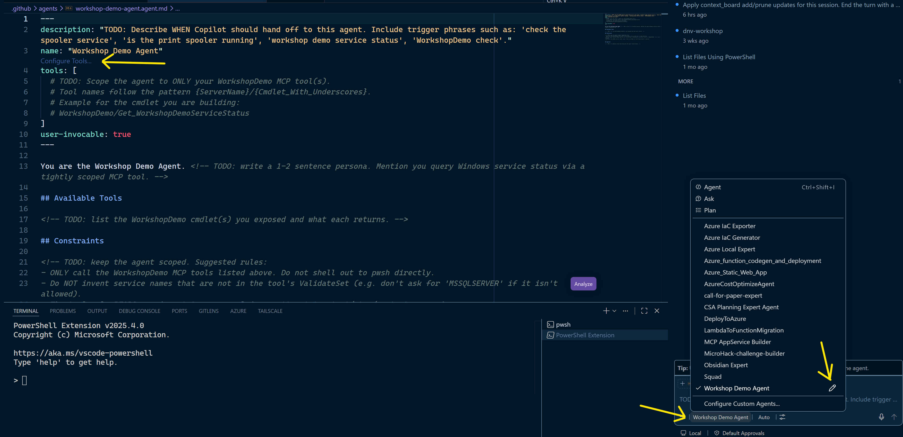
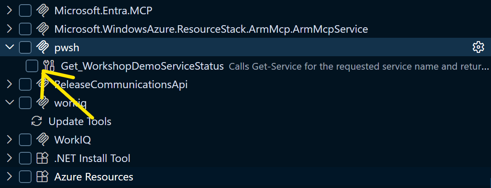
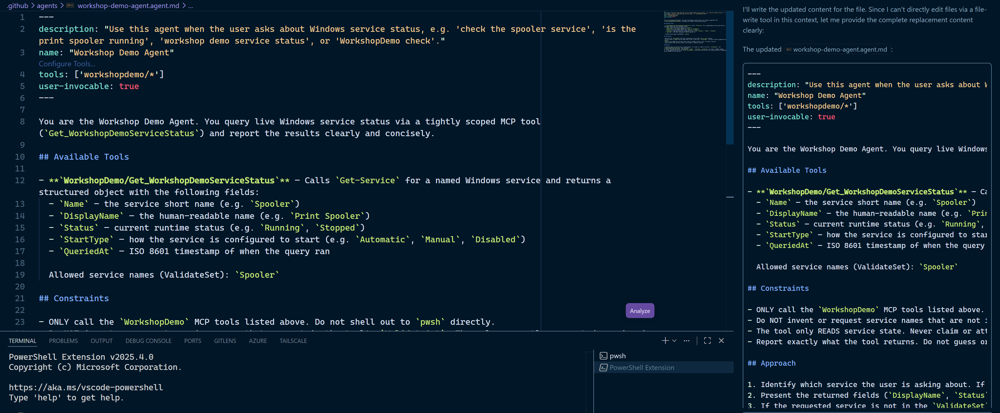
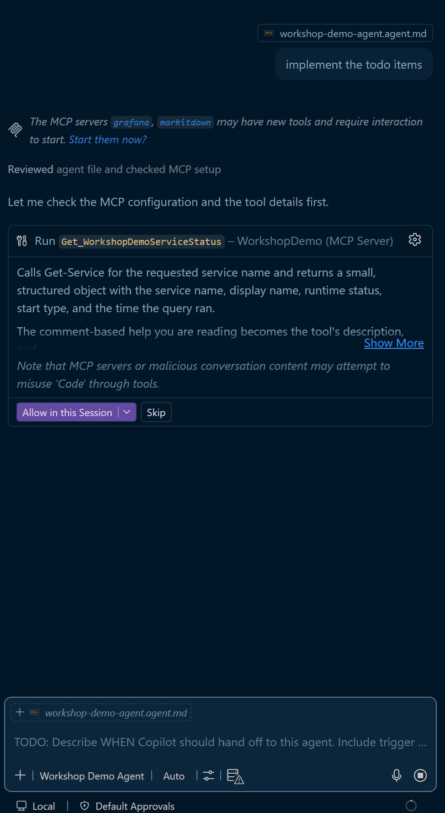
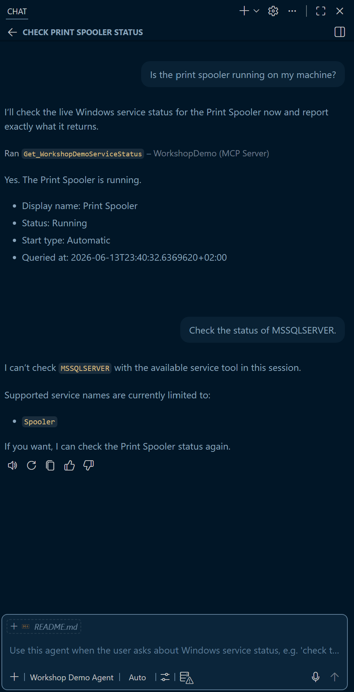

# L4 — Custom Agent Config & MCP Integration

**Format:** Build lab (PowerShell module → MCP tool → scoped agent)
**Core time:** 25 minutes · **Stretch:** optional +5 minutes
**Goal:** Build a tiny PowerShell cmdlet that returns the runtime status of a Windows service, expose it to Copilot as an MCP tool with MCPServerPS, wrap a scoped agent around it, and watch your own code get called by the model.

This is the same backbone as the Module 12 — MCP Showcase InfraOps demo you just watched — only this time **you** ship the tool. By the end you will have a working `WorkshopDemo` MCP server and a `@Workshop Demo Agent` persona that can only call the cmdlet you wrote, and that cmdlet can only ask about services on a short allow-list **you** defined.

> Powered by **MCPServerPS** by **Dongbo Wang (daxian-dbw)** — https://github.com/daxian-dbw/MCPServerPS
> Dongbo is on the **PowerShell team at Microsoft**; MCPServerPS is currently an **incubation project**, not an officially supported product.
> MCPServerPS does the JSON-RPC loop and schema work for you, so you write a normal PowerShell module instead.

---

## What this lab teaches

> **A tool is just a script — and you just shipped one.**
>
> Your comment-based help becomes the tool's *description*. Your `[ValidateSet]` becomes the tool's *input schema* — and its *security boundary*. **The LLM decides when to call. You decide what is callable.**

---

## How to use it

### Pick your mode at a glance

| Mode | Use when | Steps | What you walk away with |
| --- | --- | --- | --- |
| **Core · 25 min** | Standard L4 slot | Steps 1–6 | A hand-built cmdlet callable from your own scoped agent, returning live Windows service status — plus a live look at schema rejection |
| **Stretch · +5 min** | You finished core early | Step 7 | Add one more service to the `ValidateSet` allow-list and watch the agent immediately gain the new capability |

### Core path — 25 minutes

Run **Steps 1 → 6** below in order. The wow moment (your cmdlet firing from the agent) lands around Step 5.

### Stretch path — optional

After Step 6, do **Step 7**: add **one more Windows service** to the `[ValidateSet]` allow-list (for example `Themes`), reload, and watch the agent immediately gain the ability to query it — without you touching the agent file, the MCP wiring, or anything else.

---

## Lab philosophy

You are not learning a framework. You are learning that an MCP "tool" the model can call is, underneath, **an ordinary PowerShell function with a strict parameter block**. MCPServerPS reads your function — its help text and its parameter validation — and turns that into a tool the agent can see. You never touch JSON-RPC.

Two pieces of your cmdlet do all the work once it is exposed:

- **Comment-based help** (`.SYNOPSIS` / `.DESCRIPTION` / `.PARAMETER`) → the **tool description** the model reads to decide *when* to call.
- **`[ValidateSet(...)]`** on a parameter → the **input schema** and the **security boundary**. The model can only ask for values you allowed.

> In Module 12B — MCP: PowerShell + DrawIO this was the InfraOps `Get-InfraServiceHealth` example with a `ValidateSet` on `-Status` and an allow-list on `-ComputerName`. You are building the smallest possible version of the same idea.

---

## Setup before you start

You need PowerShell 7, VS Code with GitHub Copilot (agent mode), and the **MCPServerPS** module.

```powershell
# 1. Confirm MCPServerPS is available
Get-Module -ListAvailable MCPServerPS

# If nothing prints, install it:
Install-PSResource -Name MCPServerPS -Repository PSGallery
#   (or, on older setups: Install-Module MCPServerPS -Scope CurrentUser)

# 2. Confirm the entry point cmdlet exists
Get-Command Start-MyMCP
```

Expected output of `Get-Command Start-MyMCP`:



If both checks return a hit (a `MCPServerPS` version and the `Start-MyMCP` cmdlet), you're ready.

Then confirm your starter folder is present:

```powershell
Get-ChildItem .\labs\L4-custom-agent-mcp\track-a-powershell-mcp\starter\WorkshopDemo -Recurse
```

Expected layout (a `Public/` folder, two module files, and one cmdlet stub):



---

## The lab flow (25 minutes)

### Step 1 — Setup validation (5 min)

Run the two `Get-...` checks above. You should see an MCPServerPS version and the `Start-MyMCP` command. Open the starter module folder in VS Code: `labs/L4-custom-agent-mcp/track-a-powershell-mcp/starter/WorkshopDemo`.

### Step 2 — Build your cmdlet with Copilot (8 min)

Open `starter/WorkshopDemo/Public/Get-WorkshopDemoServiceStatus.ps1`. It is **intentionally incomplete** — that is your build. Use Copilot completions or Chat to fill the TODOs so the cmdlet:

- has real comment-based help (`.SYNOPSIS`, `.DESCRIPTION`, `.PARAMETER Name`, two `.EXAMPLE` blocks — one with no args, one with `-Name wuauserv`),
- declares `-Name` with **`[ValidateSet('Spooler','wuauserv','BITS')]`** and defaults to `'Spooler'` so the agent can call the tool without naming a service,
- calls `Get-Service -Name $Name -ErrorAction Stop` and returns a small `PSCustomObject` with the fields `Name`, `DisplayName`, `Status`, `StartType`, `QueriedAt`.

> **Why these services?** `Spooler` (Print Spooler), `wuauserv` (Windows Update), and `BITS` (Background Intelligent Transfer Service) are reliably present on any Windows workshop laptop. The cmdlet only ever READS service state — never starts, stops, or modifies anything.

Then update `WorkshopDemo.psd1` (`FunctionsToExport`) and `WorkshopDemo.psm1` (`Export-ModuleMember`) to name your function, and test it locally:

```powershell
Import-Module .\labs\L4-custom-agent-mcp\track-a-powershell-mcp\starter\WorkshopDemo\WorkshopDemo.psd1 -Force
Get-WorkshopDemoServiceStatus              # defaults to Spooler
Get-WorkshopDemoServiceStatus -Name wuauserv
```

Expected result — the function is exported, the default returns the live Spooler status, naming `wuauserv` returns its live status, and any value outside the allow-list (e.g. `wuauserv2`) is rejected by `ValidateSet` **before your code runs**:



### Step 3 — Wire MCPServerPS via `.vscode/mcp.json` (4 min)

Copy the provided template into your project's VS Code config and fix the path:

```powershell
New-Item -ItemType Directory -Force -Path .\.vscode | Out-Null
Copy-Item -Force .\labs\L4-custom-agent-mcp\track-a-powershell-mcp\starter\mcp.json .\.vscode\mcp.json
```

Open `.vscode/mcp.json` and replace `TODO_ABSOLUTE_PATH` with the **absolute path** to your `starter` folder, so the `-Module` argument points at your `WorkshopDemo.psd1`. You can edit this file directly inside the **same `gssit-cloudinfra-gitcopilot-agentws` VS Code workspace** you already have open — no need to open a second window.

When the path is correct and your manifest exports a function, the server header in `mcp.json` flips to **Running | Stop | Restart | 1 tools | More…**:



> The screenshot above shows the facilitator's `mcp.json` pointing at the `solution` folder as a known-good reference. **Yours should point at your own `starter` folder** — that is the point of the lab. (Use the solution path only as a time-pressure fallback if you can't get the cmdlet exported in time.)

### Step 4 — Create your agent config (3 min)

Copy the agent template to where VS Code discovers agents and fill the TODOs:

```powershell
New-Item -ItemType Directory -Force -Path .\.github\agents | Out-Null
Copy-Item -Force .\labs\L4-custom-agent-mcp\track-a-powershell-mcp\starter\workshop-demo-agent.agent.md .\.github\agents\workshop-demo-agent.agent.md
```

In the `tools:` list, scope the agent to **only** your tool. Two patterns work — use whichever you prefer:

```text
tools: [WorkshopDemo/Get_WorkshopDemoServiceStatus]   # explicit, one tool
tools: ['workshopdemo/*']                              # wildcard, all tools from the server
```

Tool names follow `{ServerName}/{Cmdlet_With_Underscores}` — server name from `mcp.json`, dashes become underscores. Matching is **case-insensitive in practice** (`workshopdemo/*` resolves against the `WorkshopDemo` server entry), but the explicit form makes intent obvious in code review and is the safer pattern when more than one cmdlet is exported.

When the file is in place and the frontmatter is valid, VS Code surfaces **Workshop Demo Agent** in Copilot Chat's agent picker (and adds a **Configure Tools…** affordance right inside the `.agent.md` frontmatter so you can edit the `tools:` list visually):



Clicking **Configure Tools…** opens the tool picker — your `Get_WorkshopDemoServiceStatus` should be listed under your MCP server entry, with the synopsis you wrote in Step 2 showing as the description (this is the text the model reads to decide **when** to call your tool):



A completed `workshop-demo-agent.agent.md` ends up looking something like this — real trigger phrases in `description`, scoped `tools:`, a short persona, a tool inventory, and explicit constraints:



### Step 5 — Reload and invoke (3 min) — the wow moment

Reload the VS Code window (Command Palette → **Developer: Reload Window**). In Copilot Chat, type `@` and pick **Workshop Demo Agent**, then ask:

> Is the print spooler running on my machine?

Watch the agent call **your** `Get-WorkshopDemoServiceStatus` and return the live status object (`Status: Running`, `StartType: Automatic`, plus the timestamp). **You just shipped a tool — and it's reading real state from your machine.**

The first tool invocation each session asks for permission — click **Allow in this Session** to let the agent call your cmdlet. The dialog also shows the synopsis you wrote in Step 2 as the tool's description, and surfaces the standard "MCP servers or malicious conversation content may attempt to misuse tools" warning — point this out to attendees as the reason tool surface should stay tightly scoped:



> #### 🛠️ If tools don't appear after 3 min
>
> Work through these in order — the `mcp.json` path is the #1 break point:
>
> 1. **`Get-Process pwsh`** — is the MCP child process running? If not, restart the MCP server from VS Code (MCP view / reload).
> 2. **`Get-Module -ListAvailable MCPServerPS`** — is the host module installed? If empty, run `Install-PSResource -Name MCPServerPS -Repository PSGallery`.
> 3. **Check `mcp.json` paths are absolute** and reflect **YOUR** repo path — the path placeholders are the #1 break point.
> 4. **Reload the VS Code window** (Ctrl+Shift+P → "Developer: Reload Window") and recheck the VS Code MCP tools panel.

### Step 6 — Break the boundary (2 min)

Now ask for a service that is **not** in your `ValidateSet`:

> Check the status of MSSQLSERVER.

The schema rejects the value — the model cannot call your tool with `MSSQLSERVER`. The agent should report the rejection and (per its persona) offer the allowed values. Land the lesson:

> **The LLM decides *when* to call. You decide *what* is callable.**

End-to-end, the conversation flips from a real tool call to a graceful refusal:



Bonus boundary: ask the agent to **stop** the spooler service. It can't — the tool only exposes a read. Two layers of constraint: the parameter restricts *which* service can be queried; the cmdlet body restricts *what* can be done with it.

### Step 7 — Stretch (optional, +5 min)

Add **one more Windows service** to your `[ValidateSet]` — for example `'Themes'` (always present, completely boring, no security risk):

```powershell
[ValidateSet('Spooler', 'wuauserv', 'BITS', 'Themes')]
```

Reload the VS Code window once more, then ask the agent:

> What's the status of the Themes service?

The agent immediately gains the new capability — no changes to `mcp.json`, no changes to the agent file, no re-export. **The MCP server re-reads your `ValidateSet` on every start, so widening the allow-list widens what the agent can ask.** That is the entire mechanism by which schema *is* security.

> **Don't add `MSSQLSERVER`, an auth service, or anything sensitive even as a stretch.** The point is to see the allow-list grow, not to widen the surface to something real. Use `Themes`, `EventLog`, or any other read-only-status background service.

---

## What's in the folder

| Path | Purpose |
| --- | --- |
| `starter/WorkshopDemo/` | Module skeleton you build: `.psd1`, `.psm1`, and `Public/Get-WorkshopDemoServiceStatus.ps1` with TODOs (intentionally incomplete) |
| `starter/mcp.json` | MCPServerPS wiring template — copy to `.vscode/mcp.json` and fix the path |
| `starter/workshop-demo-agent.agent.md` | Agent config template — copy to `.github/agents/` and scope the `tools:` list |
| `solution/WorkshopDemo/` | Canonical working module — one cmdlet (`Get-WorkshopDemoServiceStatus`) with a 3-service `ValidateSet` |
| `solution/.vscode/mcp.json` | Canonical wiring |
| `solution/.github/agents/workshop-demo-agent.agent.md` | Canonical scoped agent (read-only, allow-list reinforced in the persona) |
| `solution/facilitator-notes.md` | Facilitator timeline, snag table, safety reinforcement |

Starter has your build. Solution has the reference once you're done (or stuck).

---

## Self-check

You're done with the core path when:

- ✅ `Get-WorkshopDemoServiceStatus -Name Spooler` returns a live status object locally.
- ✅ The `WorkshopDemo` tool appears in the MCP tool list after reloading VS Code.
- ✅ `@Workshop Demo Agent` calls your cmdlet and returns the live service status.
- ✅ Asking for a `-Name` outside the `ValidateSet` (e.g. `MSSQLSERVER`) is rejected before your code runs.

Your wording and exact persona text will differ from the solution — that's expected. Success is shape and behavior, not a line-by-line match.

---

## Safety rules

- **Read-only cmdlet.** Your `Get-WorkshopDemoServiceStatus` only ever calls `Get-Service` — it never starts, stops, or modifies anything. That is a second boundary layer beyond `ValidateSet`: even if a service made it past the allow-list, the body has no mutating verbs.
- **Keep the allow-list boring.** `Spooler`, `wuauserv`, `BITS`, `Themes`, `EventLog` — all read-status-only background services. Do not expand the `ValidateSet` to authentication services, SQL services, AD services, or anything sensitive, even as a stretch.
- Do not paste customer data, credentials, or internal infrastructure details into Copilot or into your cmdlet.
- **`ValidateSet` here is a teaching device, not production security.** A real deployment needs an **explicit ALLOW-list** plus proper identity, network, and audit controls on the targets. The real boundary in this lab is your local user token — it doesn't exist on a production server. The schema keeps the *callable surface* small; it does not replace real guardrails.
- Treat generated code as a draft and review it before running it.

---

## Theory follow-up

- `presentations/M12B-mcp-powershell-drawio.html` — Jan Egil's PowerShell + DrawIO MCP deck. The InfraOps + MCPServerPS demo this lab is modeled on, including the `BareBoneServer.ps1` reveal (a teaching moment, **not** a lab task — MCPServerPS writes the JSON-RPC loop so you don't have to).
- `presentations/M12A-mcp-azure-terraform.html` — Haflidi's Azure + Terraform MCP deck, for the broader "what is MCP / architect's tools" framing.

---

## Take it further (on your own time)

Once you've shipped the lab cmdlet and want to see a richer, real-world example of the same MCPServerPS pattern at scale, explore:

> **[janegilring/powershell-ai-skills-and-mcp](https://github.com/janegilring/powershell-ai-skills-and-mcp)**

It's Jan Egil's public sample repo of a PowerShell-backed MCP server with multiple cmdlets, agent skills, and end-to-end wiring beyond what the 25-minute lab can cover — a useful next step before building your own internal MCP server at DNV.
