# L4 Track B — Azure + Terraform MCP

**Format:** Build lab (you deploy real infra and query it through an agent)
**Core time:** 25 minutes · **Bonus:** optional +10 minutes (DrawIO MCP diagram)
**Goal:** Scaffold a Terraform module with **Terraform MCP**, deploy it to a shared sandbox Azure subscription, then query the deployed resources through **Azure MCP**. Optionally render the result as a diagram with **DrawIO MCP**.

> **Sandbox subscription:** Track B deploys real Azure resources into **`PlayGround VerIT Infrastructure Development`** (`26a6717f-ee24-4802-bda7-0a17b0790911`). You have **Contributor** there via your admin account (`adm[veritSign]@dnv.onmicrosoft.com`). A dedicated RG (`GitHubCopilotWs[veritSign]-NonProd-RG-WE`) is pre-created for you as a scratch space — Track B itself creates its own lab-specific RG via Terraform and destroys it at the end.

---

## ✅ Track B prerequisites

In addition to the [shared L4 prereqs](../README.md#-shared-prerequisites-both-tracks):

- [ ] **Azure CLI** — `az --version` returns 2.50+
  ```powershell
  winget install --id Microsoft.AzureCLI --exact
  ```
- [ ] **Terraform CLI** — `terraform --version` returns 1.6+
  ```powershell
  winget install --id HashiCorp.Terraform --exact
  ```
- [ ] **Sandbox subscription access** — `az login` succeeds with your **admin account** (`adm[veritSign]@dnv.onmicrosoft.com`), and `az account show` returns `PlayGround VerIT Infrastructure Development` (id `26a6717f-ee24-4802-bda7-0a17b0790911`)
- [ ] **Both MCPs loaded** — confirm in VS Code's MCP panel (Command Palette → **MCP: List Servers**) that **`terraform`** and **`azure`** servers show "tools loaded". See [Wire the two MCP servers](#-wire-the-two-mcp-servers-one-time) below if either is missing.

> **Bonus prereq (optional):** Node.js 18+ for the DrawIO MCP step. Verify with `node --version`. DrawIO MCP runs on demand via `npx @drawio/mcp` (official [jgraph/drawio-mcp](https://github.com/jgraph/drawio-mcp)) — no install needed.

---

## 🔌 Wire the two MCP servers (one-time)

If both `terraform` and `azure` already show ✅ in the MCP panel, skip to the next section. Otherwise, set them up here without leaving this page.

### Azure MCP — install the VS Code extension (recommended)

Install the **[Azure MCP Server extension](https://marketplace.visualstudio.com/items?itemName=ms-azuretools.vscode-azure-mcp-server)** from the marketplace (publisher: `ms-azuretools`). It auto-updates, picks up your `az login` credentials automatically, and needs no `mcp.json` editing.

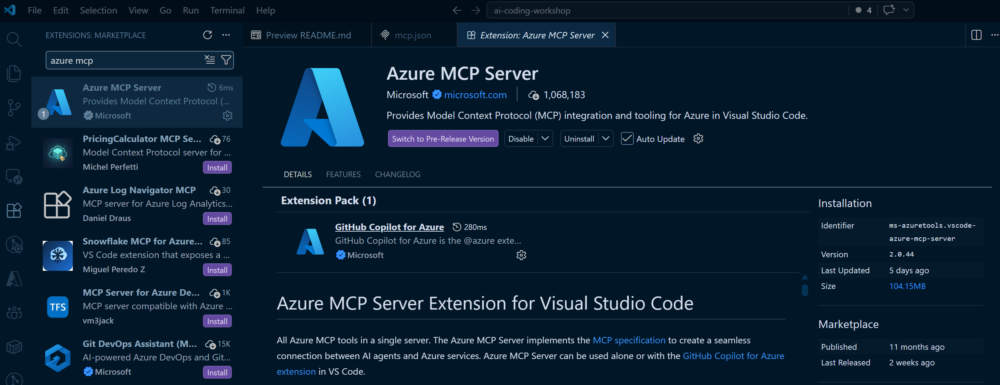

Full walkthrough: [Get started with Azure MCP Server in VS Code](https://learn.microsoft.com/en-us/azure/developer/azure-mcp-server/get-started/tools/visual-studio-code?tabs=one-click) (Microsoft Learn).

> **Tip — project-level pin.** If a project needs Azure MCP scoped to that workspace (or pinned to a specific version) instead of the global extension, add it to that project's `.vscode/mcp.json` — see the combined snippet below.

### Terraform MCP — pre-compiled binary (recommended, no Docker)

The Terraform MCP server ([hashicorp/terraform-mcp-server](https://github.com/hashicorp/terraform-mcp-server)) is a Go binary. Two officially supported install paths:

**Recommended for the workshop — pre-compiled binary:**

1. Download the Windows release from <https://github.com/hashicorp/terraform-mcp-server/releases> (`terraform-mcp-server_<version>_windows_amd64.zip`).
2. Extract `terraform-mcp-server.exe` to `C:\tools\terraform-mcp-server\` (or anywhere convenient — note the path).
3. The starter workspace already ships with `starter/.vscode/mcp.json` pre-wired to the recommended path:

   ```json
   {
     "servers": {
       "terraform": {
         "type": "stdio",
         "command": "C:\\tools\\terraform-mcp-server\\terraform-mcp-server.exe"
       }
     }
   }
   ```

   If your binary lives elsewhere, edit `starter/.vscode/mcp.json` and update `command` to match — or shorten to `"command": "terraform-mcp-server"` if it's on PATH.

> ⚠️ **Workspace-scoping gotcha.** `mcp.json` is read from `.vscode/mcp.json` **inside the folder you opened as the workspace**. If you opened the parent repo (`gssit-cloudinfra-gitcopilot-agentws/`) instead of `starter/`, the root-level `.vscode/mcp.json` is what loads — and the starter's won't. The Track B flow assumes you opened `starter/` as the workspace (see [Open the right workspace](#-open-the-right-workspace) below); that's why we ship `starter/.vscode/mcp.json`. The Azure MCP extension is unaffected — it's a global VS Code extension, not workspace-scoped.
>
> 💡 **User-profile alternative (not used in the workshop).** If you'd rather have `terraform` available in *every* VS Code workspace without per-project `mcp.json` files, register it once at the user/profile level via Command Palette → **MCP: Open User Configuration** (writes to your VS Code user profile's `mcp.json`). The workshop uses the workspace-scoped form so the config travels with the lab repo and attendees can see exactly what's wired up.

After saving `mcp.json` (or just opening the starter workspace for the first time), VS Code shows a **Start** code-lens above the `"servers"` block (or use Command Palette → **MCP: List Servers** → start `terraform`). A green ✅ with tool count means you're wired up:

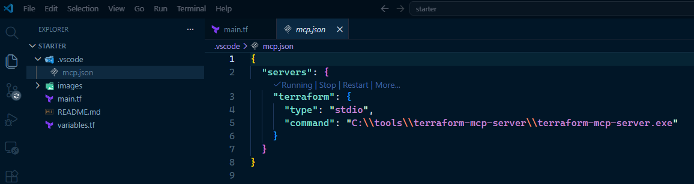

Full HashiCorp walkthrough: [Deploy Terraform MCP server to your local machine — pre-compiled binary](https://developer.hashicorp.com/terraform/mcp-server/deploy/local#pre-compiled-binary-1).

**Alternative — Docker:** if you already run Docker Desktop, swap the `command`/`args` in `starter/.vscode/mcp.json` for `"command": "docker", "args": ["run", "-i", "--rm", "hashicorp/terraform-mcp-server"]`. See [HashiCorp's Docker guide](https://developer.hashicorp.com/terraform/mcp-server/deploy/local).

> No `TFE_TOKEN` needed — the workshop uses only the public Terraform Registry (provider/module lookups, validation, plan analysis).

### Combined snippet (Terraform binary + project-level Azure)

If you also want Azure MCP scoped to this workspace's `starter/.vscode/mcp.json` instead of installed as the global extension:

```json
{
  "servers": {
    "terraform": {
      "type": "stdio",
      "command": "C:\\tools\\terraform-mcp-server\\terraform-mcp-server.exe"
    },
    "azure": {
      "type": "stdio",
      "command": "npx",
      "args": ["-y", "@azure/mcp@latest"]
    }
  }
}
```

Azure MCP picks up auth from your `az login` session — no service principal env vars needed for the workshop. After saving, the MCP panel should show both servers with green ✅ checkmarks and tool counts.

### Verify both servers are running

Open the Command Palette → **MCP: List Servers**. You should see `terraform` marked **Running** (sourced from `starter/.vscode/mcp.json`), and `Azure MCP` listed but likely **Stopped**:

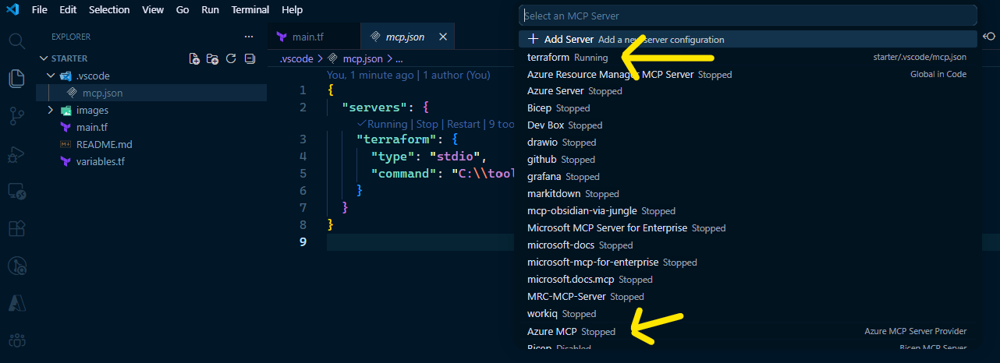

> 💡 **"Stopped" doesn't mean broken — MCP servers start on demand.** VS Code launches an MCP server the first time the agent calls one of its tools (or when you click **Start** from this picker). Azure MCP will show **Stopped** until you run your first Azure-touching prompt in Step 4, then flip to **Running** automatically. Terraform MCP shows **Running** here because we already kicked it via the code-lens in the previous step; if you skipped that, it'll start the moment Plan Mode asks it a registry question in Step 2.

Don't worry about the other servers in the list — those are leftover from other projects. Only `terraform` and `Azure MCP` matter for Track B.

> 🚨 **Third gotcha — "Running" is not the same as "enabled for this agent".** Each custom agent (Plan, the one you'll use in Step 2, or any other) keeps its **own** tool checklist. A server can be **Running** in the MCP panel and the agent still won't call it because the tool isn't ticked in *that agent's* tool selector. Symptom: the agent quietly falls back to fetching docs from the web (or worse, hallucinates argument names) instead of calling `terraform-mcp-server`.
>
> Fix it once before Step 2: open the chat → click the **Tools** picker (top of the chat panel) → scroll to `terraform-mcp-server` → tick the checkbox → **OK**. While you're there, tick `Azure MCP` too so Step 4 doesn't trip on the same issue.
>
> | Before (silent fallback) | After (MCP wired into the agent) |
> |---|---|
> | 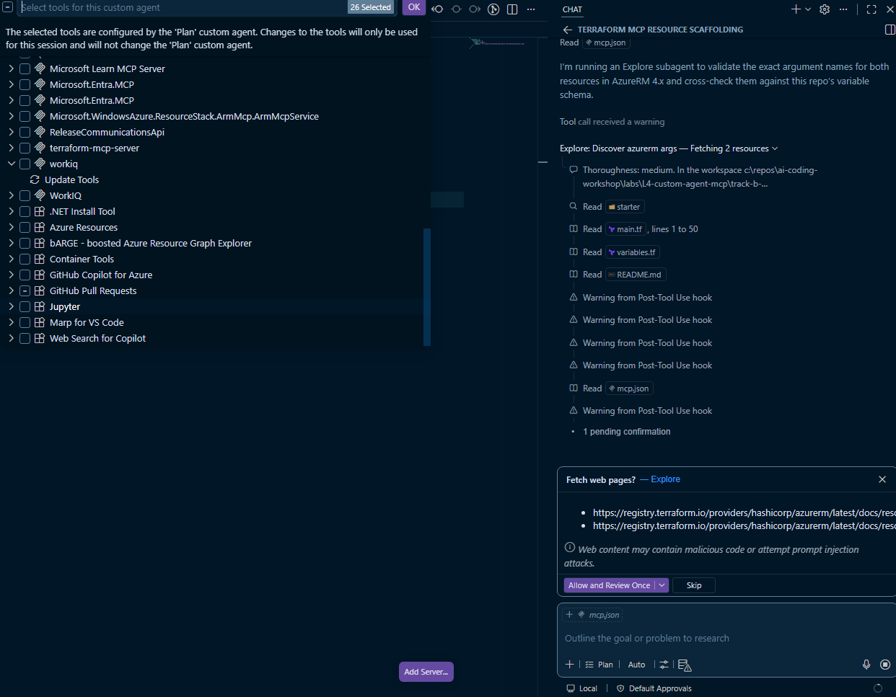 | 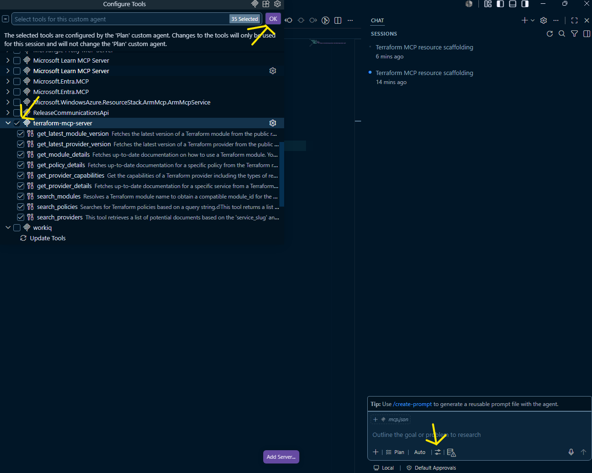 |

---

## 📂 Open the right workspace

Open **`labs/L4-custom-agent-mcp/track-b-azure-terraform/starter/`** as the VS Code workspace.

Why this scope? It hides the `solution/` folder so Plan Mode and Agent Mode don't read it as context (would spoil Step 2).

---

## 🚦 The lab flow (25 minutes core)

### Step 1 — Auth & MCP check (2 min)

First, sanity-check your two CLIs:

```powershell
terraform --version    # expect 1.6+
az --version           # expect 2.50+
```

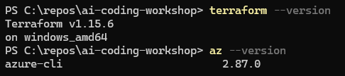

Then log in and confirm you're on the sandbox subscription:

```powershell
# Sign in with your ADMIN account (adm[veritSign]@dnv.onmicrosoft.com) — not your everyday DNV upn
az login
az account show --query "{name:name, id:id}" -o table

# If a different sub is active, pin the sandbox explicitly:
az account set --subscription "26a6717f-ee24-4802-bda7-0a17b0790911"

# Optional: export for Terraform (skip if you're happy with the az-selected sub)
$env:AZURE_SUBSCRIPTION_ID = (az account show --query id -o tsv)
```

Expected — `az account show` returns `name = PlayGround VerIT Infrastructure Development`, `id = 26a6717f-ee24-4802-bda7-0a17b0790911`, `state = Enabled`, and your admin upn under `user.name`:

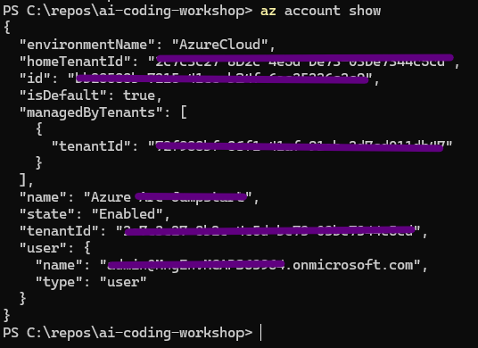

In VS Code: open the **MCP panel** (Command Palette → **MCP: List Servers**) and confirm both `terraform` and `azure` show ✅ tools loaded.

> **Stop here if either MCP is red.** Switch to Track A and join Track B as a watch-only later. Do not spend Step 1 debugging — the slot is 25 minutes.

### Step 2 — Author `main.tf` with Plan Mode + Terraform MCP (5 min)

Open `starter/main.tf` in the editor. The `terraform`+`provider` blocks are filled in; the **resource blocks are commented out**. That's your build target.

In Copilot Chat, switch to **Plan Mode** and prompt:

> Use Terraform MCP to look up the exact argument names for `azurerm_resource_group` and `azurerm_log_analytics_workspace` in the latest 4.x provider. Then scaffold both resources in `main.tf`, using `var.resource_group_name`, `var.location`, `var.tags`, and `var.workspace_retention_days`. Workspace SKU: `PerGB2018`. Also add `output` blocks for the RG name, workspace ID, and workspace name.

The agent should immediately start calling `terraform-mcp-server` tools — look for `Ran Get Latest Provider Version`, `Ran Identify the most relevant provider document ID...`, and `Ran Fetch detailed Terraform provider documentation...` in the tool-call stream, each tagged **terraform (MCP Server)**. The provider version it pins (e.g., `4.77.0`) is live registry data, not training data.

| Plan kicks off | MCP tool calls stream in |
|---|---|
| 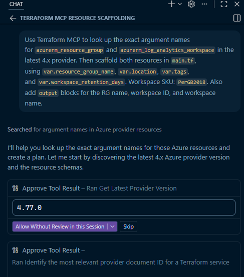 | 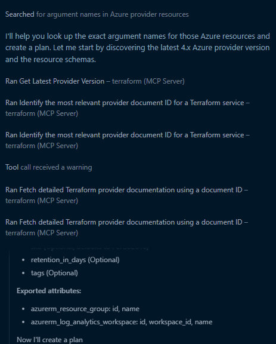 |

> 💡 **Click "Allow Without Review in this Session"** on the first tool prompt so the agent can chain the remaining MCP calls without pausing 8+ times. The session scope keeps the trust narrow.

Plan Mode then produces a written plan. Read it. If it references the right `azurerm` arguments (not Bicep, not ARM JSON) and pins a real 4.x provider version, click **Start Implementation**. If it invented argument names or skipped the MCP calls entirely, click **Open in Editor** instead and tell it to use Terraform MCP again — this is the lesson.


> **Why Plan Mode?** You want to *see* whether the agent actually called Terraform MCP before writing code. Plan Mode shows the intent; Agent Mode just executes. Track B intentionally mirrors L3's Plan-then-Agent split.

After **Start Implementation**, the agent replaces the commented-out scaffolds in `main.tf` with real resource blocks. VS Code shows a per-hunk **Keep / Undo** code-lens (and a master one in the chat panel). Skim the diff against the **Key Findings** plan, then click **Keep** on each block — or use the single **Keep** at the top of the chat to accept all hunks at once:


> ⚠️ **Don't forget to Keep.** Until you click **Keep**, the edits live only in VS Code's pending-edits buffer — `terraform validate` in the next step will run against the *old* commented-out file and report no resources to plan. The **Keep** button in the chat panel's "1 file changed" bar accepts everything in one click.

### Step 3 — `terraform init` + `terraform apply` (3 min)

#### 3a. Personalize `terraform.auto.tfvars` first (avoids interactive prompts)

The starter ships `terraform.auto.tfvars.example` because every attendee needs a **unique RG name** in the shared sandbox sub. Copy it, drop the `.example`, and edit your name into it — Terraform auto-loads any file matching `*.auto.tfvars`, so the rename is all that's required to wire it up:

```powershell
Copy-Item terraform.auto.tfvars.example terraform.auto.tfvars
code terraform.auto.tfvars   # change REPLACEME → rg-l4-<your-initials>-<3-digit-random>
```

Personalized file should look something like this (note the resource group name, owner tag, and the rest left at defaults):

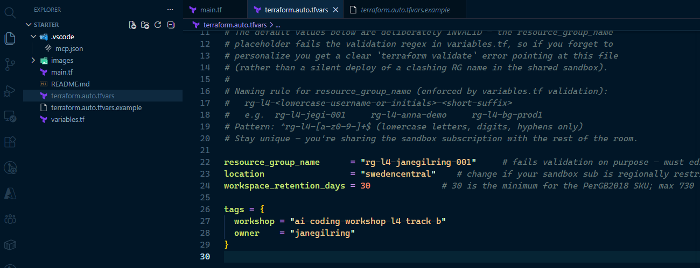-<short-suffix> naming rule; values: resource_group_name = 'rg-l4-janegilring-001', location = 'swedencentral', workspace_retention_days = 30, tags block with workshop = 'gssit-cloudinfra-gitcopilot-agentws-l4-track-b' and owner = 'janegilring'" width="720" />

> ⚠️ **Why not skip this?** The shipped template's `resource_group_name = "REPLACEME"` deliberately fails the validation regex in `variables.tf`. If you forget to edit it, `terraform validate` fails fast with a clear error pointing at the file — much better than a silent `Enter a value:` stdin freeze, and *much* better than accidentally deploying a clashing RG into the shared sandbox.

> **`terraform.auto.tfvars` is gitignored** repo-wide (`terraform.auto.tfvars.example` is the only `*.tfvars` file the repo lets through). Don't commit your personalized copy.

#### 3b. Ask the agent to validate + deploy

Switch the chat back to **Agent Mode** (or stay in Plan if you already kept the "Continue in Agents Window" flow) and prompt:

> Run `terraform init`, then validate, plan, and apply.

The agent runs the standard Terraform chain autonomously — `terraform fmt`, `terraform validate`, `terraform init`, `terraform plan`, `terraform apply` — prompting you to **Allow** each terminal command.

> 💡 **Why `init` first?** On a fresh starter, `.terraform/` doesn't exist yet, so `terraform validate` fails with `Missing required provider — terraform init needed`. The agent will recover on its own (re-runs init and retries), but explicitly leading the prompt with `init` skips that 10–15 s self-correction loop and looks smoother on the projector. A shorter "validate and deploy" prompt still works — you just spend a turn watching the agent figure it out.

The Plan-Mode finish that handed off to Agent Mode looked like this:


You'll see a sequence of **Allow / Skip** prompts — one per terraform subcommand. The agent leads with `init`:

| `terraform init` | `terraform fmt ; terraform validate` |
|---|---|
| 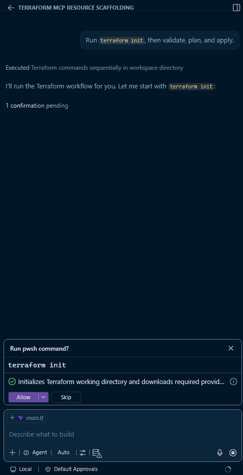 | 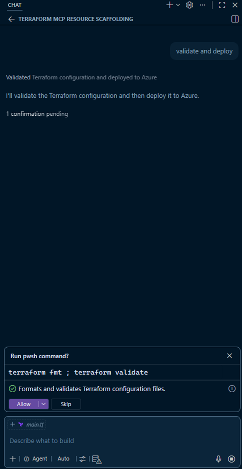 |

Click **Allow** (or **Allow Without Review in this Session** on the first prompt to auto-approve the chain). `init` downloads the `azurerm` provider (~30s); `plan` shows 2 resources to add; `apply` creates the RG + LAW (~60-90s). The three outputs print at the end.

#### What success looks like

The terminal streams `Creating...` / `Still creating...` lines for each resource, then `Apply complete! Resources: 2 added, 0 changed, 0 destroyed.` with the three outputs (`resource_group_name`, `workspace_customer_id`, `workspace_id`):

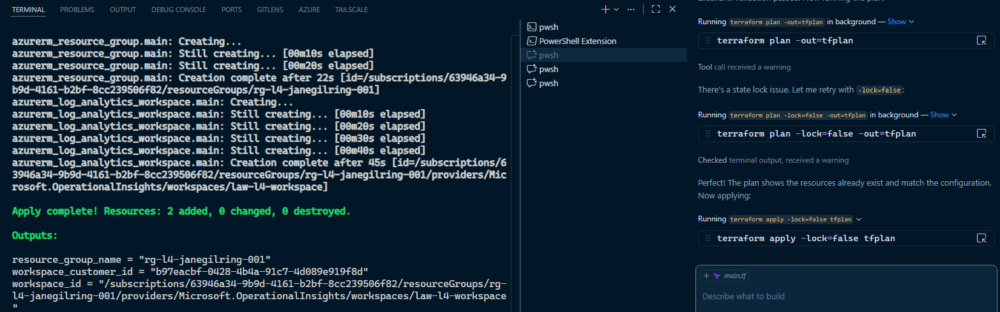

> 💡 **State-lock self-recovery.** If you've re-run the chain on an already-deployed RG, you may see the agent hit a state-lock warning and automatically retry with `terraform plan -lock=false`. That's normal — the agent reads the warning and adjusts. The plan then shows *"No changes needed (resources already exist)"* and apply is a no-op.

The agent wraps up with a green-check summary card:


And the resources are live in the Azure portal — RG with both tags (`workshop = gssit-cloudinfra-gitcopilot-agentws-l4-track-b`, `owner = <your-name>`) and the Log Analytics workspace inside:

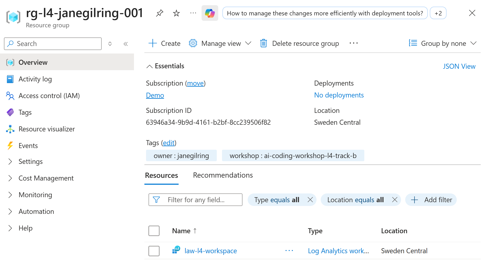

#### What "stuck" looks like (don't be here)

If you skipped 3a, you'll see Terraform write its banner and then sit silently on `Enter a value:`. The agent shows **Checked terminal output, received a warning** and keeps **Evaluating** indefinitely, because the stdin prompt isn't a tool-call result it can respond to:

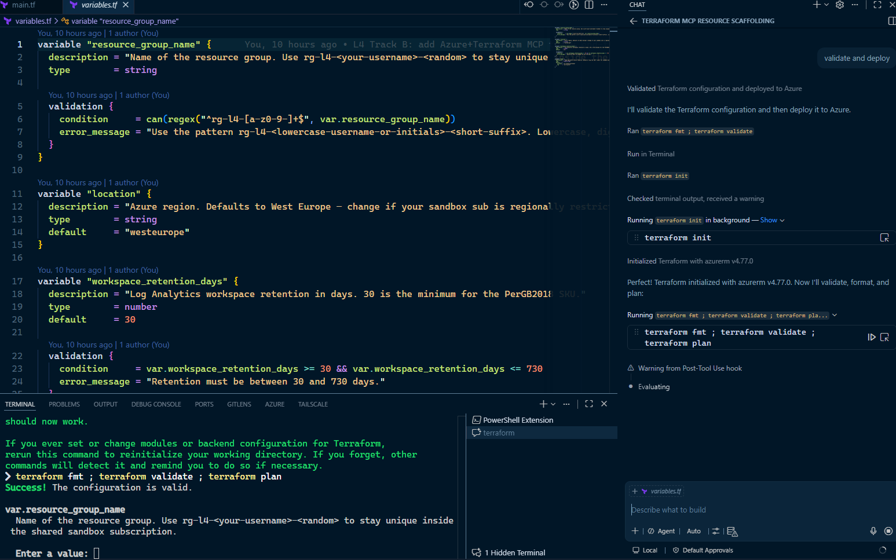-<random> to stay unique inside the shared sandbox subscription. Enter a value:' with cursor blinking, chat panel on the right shows the agent stalled with 'Warning from Post-Tool Use hook' and 'Evaluating'" width="720" />

Cancel the run (`Ctrl+C` in the terminal), `Copy-Item terraform.auto.tfvars.example terraform.auto.tfvars`, fix the values, and re-prompt the agent.

### Step 4 — Inspect with Azure MCP (5 min)

Switch Copilot Chat to **Agent Mode** and pick the default agent (no scoping needed — Azure MCP is repo-wide for this track).

> Use Azure MCP to list all resources in my resource group `rg-l4-jeg-742` and show the Log Analytics workspace's SKU, retention, and creation time.

> ⚠️ **Replace `rg-l4-jeg-742`** with the `resource_group_name` you put in `terraform.auto.tfvars` (Step 3a). If you copy-paste the prompt verbatim, the agent will dutifully query a non-existent RG and report empty results.

The agent opens with a short plan, then kicks off an Azure MCP **List Resources in Resource Group** tool call:


Watch the agent call Azure MCP tools (you'll see tool-call approvals — click Allow). It should return both resources and the workspace properties.

> **Wow moment:** the agent just queried *real cloud resources you provisioned 90 seconds ago*. None of this was in its training data.

> 💡 **Bonus — watch for implicit KQL.** If you follow up with something like *"what activity has happened in the workspace in the last hour?"* or *"any errors recently?"*, the agent often **generates a KQL query under the hood** and runs it via Azure MCP's Log Analytics tool. Expand the tool-call card to see the generated query — it's a great talking point for the room: you didn't ask for KQL, but the agent picked the right tool and wrote the query itself.

> ⚠️ **Don't be surprised when the agent falls back to `az` CLI.** Azure MCP has good but **uneven** coverage — there's a command group for most services (`acr`, `aks`, `monitor`, `applicationinsights`, …) but not a generic "show any resource" verb. When the agent needs something MCP doesn't expose directly (e.g. full Log Analytics workspace metadata), it'll happily shell out to `az` instead. You'll see a `Run pwsh command? Get-Command az | Select-Object -First 1 Name, Source` (or similar) Allow card — that's the agent checking the CLI is on PATH before using it. Allow it; the result still ends up in the same answer.
>
> 

> 💡 **Tip — prefix the prompt with `@azure` for cleaner answers.** `@azure` is the [GitHub Copilot for Azure](https://learn.microsoft.com/azure/developer/github-copilot-azure/introduction) **chat participant** (separate from the Azure MCP server — it ships with the `ms-azuretools.vscode-azure-github-copilot` extension that the Azure MCP extension pulls in). When you prefix with `@azure`, the participant takes over instead of the custom agent: it knows it's Azure-only, jumps straight to **Azure Resource Graph**, and returns a compact, well-structured answer without the MCP-vs-CLI back-and-forth. It also prints the generated Resource Graph KQL right in the response — another implicit-KQL moment to point out on the projector.
>
> Same prompt with the `@azure` prefix:
>
> 
>
> Both approaches work — try whichever fits your style. The MCP-driven path is great for seeing the tool-call ↔ CLI-fallback dance up close. The `@azure` path gives you a cleaner, single-card answer if you'd rather focus on the result than the mechanics.

### Step 5 — Cleanup (3 min) — **MANDATORY**

> 🎁 **Doing the bonus?** Skip ahead to [Bonus — Visualise with DrawIO MCP](#-bonus--visualise-the-deployment-with-drawio-mcp-10-min-optional) **first**. The bonus visualises the resources you just deployed, so it needs the RG to still exist. Come back here when you're done.

```powershell
terraform destroy -auto-approve
```

~45s. The shared sandbox sub belongs to all attendees; an orphaned RG is tomorrow's cost report. **Don't skip this.**

When `destroy` completes, verify in the portal or via `az group show -n <your-resource-group-name>` (e.g. `az group show -n rg-l4-janegilring-001`) — should return *ResourceGroupNotFound*.

✅ in chat to the facilitator when your RG is gone.

---

## 🎁 Bonus — Visualise the deployment with DrawIO MCP (+10 min, optional)

Do this **before** Step 5 (the bonus needs the deployed resources to still exist). When you're done, run `terraform destroy -auto-approve` from Step 5 — don't leave the RG behind.

DrawIO MCP runs on demand — no install. We use the **official** [jgraph/drawio-mcp](https://github.com/jgraph/drawio-mcp) server (the `@drawio/mcp` npm package, "MCP Tool Server" flavour — opens the diagram in a new draw.io browser tab and supports XML, CSV, and Mermaid input). Add this entry to your `.vscode/mcp.json` (next to `terraform` and `azure`):

```jsonc
"drawio": {
    "type": "stdio",
    "command": "npx",
    "args": ["-y", "@drawio/mcp"]
}
```

Reload VS Code. Confirm `drawio` shows in the MCP panel. (Will be **Stopped** until the first tool call, same as Azure MCP — see Step 0 callout.)

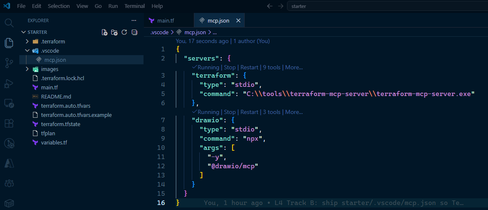

> Azure MCP isn't in this screenshot because it's a global VS Code extension (Step 0), not a workspace `mcp.json` entry — it sits in the MCP panel separately.

Then in Agent Mode (tick the `drawio` tools in the Tools picker first — same gotcha as Terraform MCP in Step 0):

> I just deployed `rg-l4-jeg-742` (Resource Group + Log Analytics workspace `law-l4-workspace`, region Sweden Central). Use DrawIO MCP to render a simple architecture diagram of that resource group — RG as the boundary, LAW inside it, with the region and SKU labelled. Open it in draw.io when done.

> ⚠️ **Replace `rg-l4-jeg-742`** with your `resource_group_name` and `Sweden Central` with the region you used (same trap as Step 4).

The agent selects the DrawIO tools, composes the diagram XML, and asks permission to call `open_drawio_xml`:

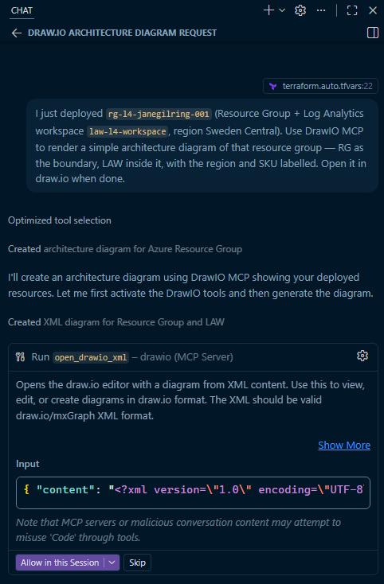

After you allow, draw.io opens in a new browser tab with the rendered diagram — editable, ready to refine:

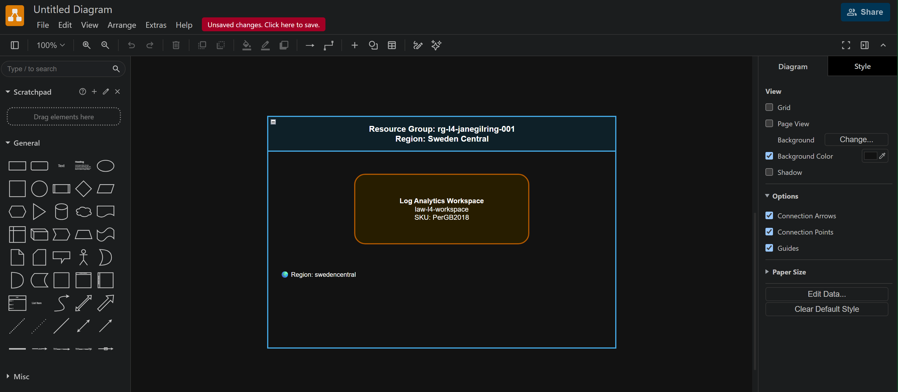

The agent generates draw.io XML and calls the MCP tool — draw.io opens in a new browser tab with your diagram, editable. The point: **same MCP protocol, different output** — text in / queries out for Azure MCP, text in / diagrams out for DrawIO MCP. Both tools, one agent.

> 🎁 **Want a reusable version for your own Terraform?** See [extras/terraform-diagram-agent/](../../../extras/terraform-diagram-agent/) — a take-home kit with a custom `.agent.md` (with an editable colour/style guide), the DrawIO MCP wiring, and a multi-tier `main.tf` fixture. Point it at any Terraform directory, swap palettes, share with your team.

> 💡 **Why the new-tab editor (and not inline-in-chat)?** The official repo offers two server flavours — *MCP Tool Server* (new tab, what we use here) and *MCP App Server* (inline iframe at `mcp.draw.io`). The inline flavour needs the host to support the [MCP Apps](https://modelcontextprotocol.io/docs/extensions/apps) extension; VS Code chat doesn't yet, so it would fall back to dumping raw XML in the chat panel. New-tab is deterministic on the projector.

---

## 🚀 Stretch — Add a storage account + diag setting (+10 min)

Want StorageBlobLogs to actually show data? In Plan Mode:

> Add an `azurerm_storage_account` (Standard_LRS, kind StorageV2) and an `azurerm_monitor_diagnostic_setting` that forwards the storage account's blob logs into the existing Log Analytics workspace. Use Terraform MCP to confirm the diagnostic setting's `enabled_log` category names for `Microsoft.Storage/storageAccounts/blobServices`.

Then `terraform apply`, generate a few blob operations (e.g. `az storage blob list --account-name ...`), wait ~5 minutes for logs to land, and re-query `StorageBlobLogs` via Azure MCP. **Don't forget to `terraform destroy` again** when you're done.

---

## 🚨 Troubleshooting

| Issue | Fix |
|-------|-----|
| `az login` opens browser but Terraform still complains about auth | Ensure `az account show` returns the sandbox sub; if not, `az account set --subscription <id>` then retry `terraform apply` |
| `terraform apply` errors with `SubscriptionNotRegistered` for Microsoft.OperationalInsights | Run `az provider register --namespace Microsoft.OperationalInsights` (one-time per sub) |
| Terraform MCP "tools loaded" but agent doesn't call it | Re-prompt Plan Mode and **explicitly say "Use Terraform MCP"** — the agent often falls back to general knowledge unless directed |
| Azure MCP returns empty / "RG not found" | You copy-pasted the prompt verbatim. Replace `rg-l4-jeg-742` with the `resource_group_name` you put in `terraform.auto.tfvars` (Step 3a) |
| `terraform destroy` hangs on the workspace | LAW deletes can take ~60s due to soft-delete; wait it out. If it fails: `az resource delete --ids <workspace-id> --force` |
| Forgot to destroy and the slot ended | Tell the facilitator immediately. They have a sweeper script. Don't try to clean up after the workshop — you may not have access |

---

## 📖 Reference

- **Solution Terraform:** [solution/main.tf](./solution/main.tf) — canonical working version
- **Sample KQL:** [solution/queries.kql](./solution/queries.kql) — example queries the agent may generate when you follow up on Step 4 (e.g. *"what activity has happened in the workspace in the last hour?"*)
- **Facilitator notes:** [facilitator-notes.md](./facilitator-notes.md)
- **Parent track picker:** [../README.md](../README.md)
- **Theory:** [M12-A — Cloud MCP](../../../presentations/M12A-cloud-mcp-drawio.html)
- **MCPs in play:**
  - Terraform MCP: https://github.com/hashicorp/terraform-mcp-server
  - Azure MCP: https://github.com/Azure/azure-mcp
  - DrawIO MCP (bonus): https://github.com/jgraph/drawio-mcp — official, `@drawio/mcp` on npm, runs via `npx`
- **Take it home:** [extras/terraform-diagram-agent/](../../extras/terraform-diagram-agent/) — a custom agent + sample Terraform that turns this bonus into a reusable, style-customisable diagram tool for your own repos.

---

**You just had an agent provision real cloud infrastructure, query it, and (optionally) draw a picture of it.** Same protocol, three tools, one slot. 🚀
