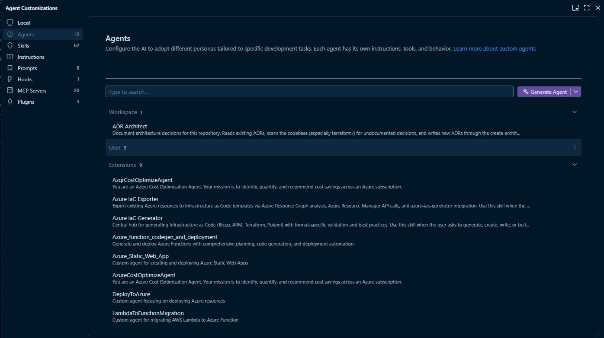
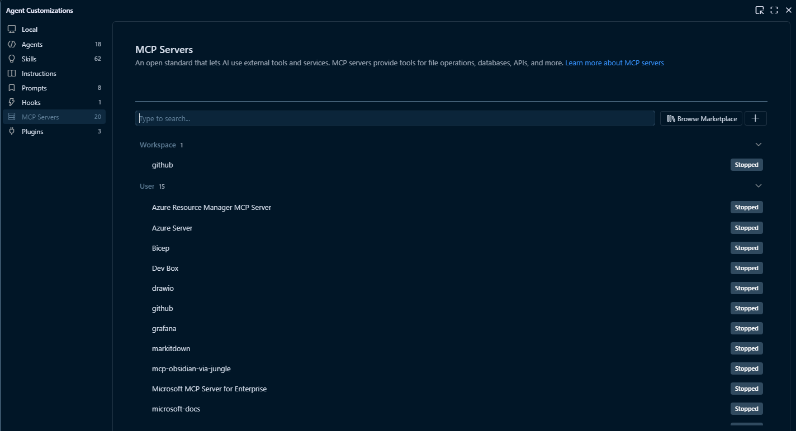
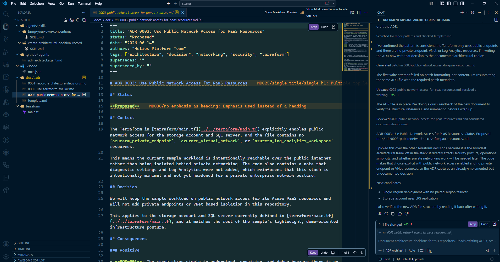
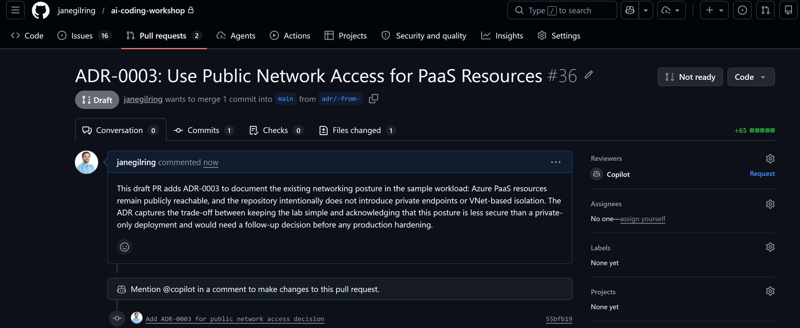
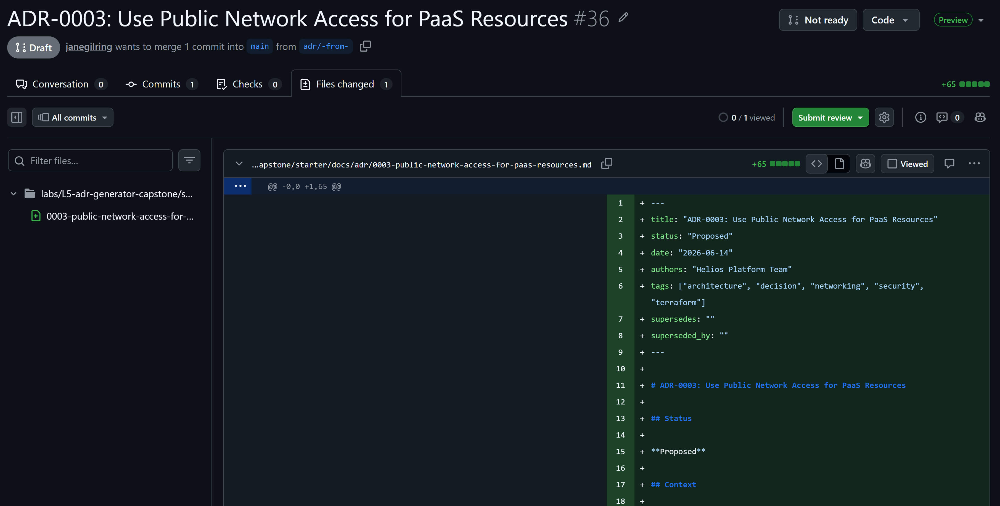

# L5 — Capstone: ADR Architect Agent

**Format:** Capstone lab (customize an upstream skill + agent for your org)
**Core time:** 45 minutes (Day 2, 17:05–17:50)
**Goal:** Take a published Copilot skill (`create-architectural-decision-record`) and a published agent (Azure Principal Architect), **customize both for your team's conventions**, then have the agent write a real ADR by reading a Terraform fixture and spotting an undocumented decision.

This is the capstone. It doesn't introduce a new mechanic — it shows what L4's MCP wiring buys you: an agent + skill that, **with the right context baked in**, can produce documentation that matches your team's standards.

---

## What this lab teaches

> **An agent is only as useful as the context you give it. You bring the conventions; the agent does the typing.**

Upstream skills and agents from the GitHub *awesome-copilot* repo are *intentionally generic*. The real value is when you take them, **point them at your team's source of truth**, and let your agent stay aligned without you re-typing it every prompt.

---

## What an ADR is

An **Architecture Decision Record** is a short markdown file capturing one decision with three classic sections — Context / Decision / Consequences — plus front matter that makes it machine-parseable. Format originally by Michael Nygard (<https://adr.github.io/>), extended by the awesome-copilot skill with coded bullets (POS-001, NEG-001, ALT-001) for richer machine + human use.

---

## How to use it

### Pick your mode at a glance

| Mode | Use when | You build |
| --- | --- | --- |
| **Core capstone · 45 min** | The standard L5 slot | Customized skill + agent + your first generated ADR |
| **Champion track** | Fast finishers | A *second* skill that points at your real conventions repo (bring-your-own-conventions) |

### Minimum viable checkpoint (the celebration moment)

> ✅ **Your ADR Architect agent read your Terraform fixture, called your skill, and wrote a new ADR file at `docs/adr/adr-NNNN-*.md` that follows the awesome-copilot template — including the org extensions you added.**

If you hit that, you have completed the capstone. Everything else is depth.

---

## Capstone philosophy

In L1 you followed TODOs. In L4 you authored MCP tools. By L5 you are working at the **agent + skill design** layer: you are not writing code, you are wiring *organisational context* into a published pattern. This is the top of the L1→L5 climb — the human brings the conventions; Copilot brings the speed.

The starter copies the upstream files verbatim with `TODO (org)` markers. The solution shows one possible customization (the `[ORG]` extensions) for a fictional platform called Helios.

---

## ⏱️ Checkpoints

- **0–5 min:** Open the starter; read the upstream skill + agent files as-is. Notice the `TODO (org)` markers.
- **5–15 min:** Customize the **skill** (`create-architectural-decision-record/SKILL.md`) — add 1–2 org requirements (e.g. WAF pillar field, cost owner field, naming gate).
- **15–25 min:** Customize the **agent** (`adr-architect.agent.md`) — trim the tools list, add org constraints, write the approach steps for *your* repo layout.
- **25–35 min:** Run the agent against `terraform/main.tf`. Watch it list existing ADRs, scan the Terraform, propose one undocumented decision, and write the ADR file.
- **35–45 min:** Review the ADR. Tweak the skill/agent and re-run if the format isn't quite right. Celebrate. 🎉

## 🚨 Escape hatch

By **minute 25**, if your customizations are getting tangled, copy the upstream files **verbatim** into `.agents/skills/` and `.github/agents/` and run the agent unchanged. You'll still get an ADR — it just won't have your org extensions. The goal is to feel the **skill + agent + context** loop, not to win a customization race.

The `solution/` folder is the canonical customized reference if you want to compare.

---

## The lab flow (45 minutes)

### Part 1 — Open the starter and see how skills got there (≈5 min)

```powershell
cd labs/L5-adr-generator-capstone/starter
code .                       # open this folder as the workspace root
```

Browse:
- `.agents/skills/create-architectural-decision-record/SKILL.md` — the upstream ADR skill, with `TODO (org)` markers.
- `.agents/skills/bring-your-own-conventions/SKILL.md` — a *thin* skill pattern: points at an upstream source-of-truth repo instead of duplicating its content. The whole skill is breadcrumbs.
- `.github/agents/adr-architect.agent.md` — derived from awesome-copilot's `azure-principal-architect`, trimmed for ADR work.
- `docs/adr/0001-*.md`, `0002-*.md`, `template.md` — two seed ADRs (Nygard-format legacy) for the agent to read.
- `terraform/main.tf` — sample Azure workload with ~5 undocumented decisions baked in.

> 💡 The seed ADRs use Michael Nygard's simple 3-section format. The awesome-copilot skill produces the richer `adr-NNNN-*.md` front-matter format. Both can coexist — you don't need to migrate the seeds; just don't re-number them. This is the realistic case: legacy ADRs stay, new ones use the new template.

#### How the skill got into `.agents/skills/`

We pre-installed the upstream skill so the lab works offline. **In your real repo, install it yourself with the GitHub CLI:**

```powershell
# Recommended — official CLI, drops the skill at .agents/skills/<name>/SKILL.md
gh skill install github/awesome-copilot create-architectural-decision-record

# Browse what else is available, install interactively
gh skill install github/awesome-copilot
```

> Per the [`gh skill install` spec](https://cli.github.com/manual/gh_skill_install), the default scope is `project` (= current repo) and the default agent is `github-copilot`. The CLI injects source-tracking metadata into the SKILL.md frontmatter so `gh skill update` can detect upstream changes later.

If you can't (or won't) install the GitHub CLI extension, the manual fallback is fine — it's just `git clone` + `Copy-Item`:

```powershell
# Manual fallback
New-Item -ItemType Directory -Force -Path .agents\skills | Out-Null
git clone --depth 1 https://github.com/github/awesome-copilot $env:TEMP\awesome-copilot
Copy-Item -Recurse $env:TEMP\awesome-copilot\skills\create-architectural-decision-record .agents\skills\
```

Either way, the skill ends up at `.agents/skills/create-architectural-decision-record/SKILL.md` — that's the path Copilot reads from (per the [Agent Skills specification](https://agentskills.io/specification)). Edit it freely once it's there.

#### See it in the UI — Agent Customizations

Once the workspace is open, click the **gear icon** at the top-right of the Chat view to open **Agent Customizations**. You'll see your two workspace skills (`create-architectural-decision-record`, `bring-your-own-conventions`) under **Skills → Workspace**, and your `ADR Architect` agent under **Agents → Workspace**. The same panel lists **Instructions**, **Prompts**, **Hooks**, **MCP Servers**, and **Plugins** — every kind of customization Copilot loads, in one place.



> 💡 Customizations resolve from **three scopes**: **Workspace** (this repo — what you just edited), **User** (your personal profile, follows you across repos), and **Extensions** (anything VS Code extensions contribute — e.g. `AzqrCostOptimizeAgent`, `Azure IaC Generator`, `LambdaToFunctionMigration` in the screenshot above). This is the easiest way to discover what extensions have shipped agents/skills into your VS Code without you realising it. Workspace wins on naming conflicts.

The **MCP Servers** tab in the same panel is the equivalent for MCP — you can see every server resolved from `.vscode/mcp.json` (workspace), your user profile, and extensions, with start/stop status badges and a **Browse Marketplace** button for discovering new ones:



In the screenshot, our workspace's `github` server (the one wired in `starter/.vscode/mcp.json` for the optional Ship-it track) shows up at the top under **Workspace**. The User scope below it includes the **Azure Resource Manager MCP Server** from L4 (which backs the `'azure-server/*'` tool family in the agent), plus other servers picked up across previous labs (`drawio`, `microsoft-docs`, `bicep`, etc.). Same three-scope model as agents and skills.

> 💡 The `Generate Skill` / `Generate Agent` buttons (top-right of each tab) are LLM-assisted authoring — useful after the lab when you want to bootstrap a new skill from a prose description. For L5 we customize the published ones by hand so you see exactly what's going on.

The panel is also the quickest way to confirm a file you just edited is being picked up: if the count goes up or your skill appears under **Workspace**, Copilot can see it. If it doesn't show, the path is wrong (`.github/skills/` is the old layout — the spec is `.agents/skills/`).

### Part 2 — Customize the skill (≈10 min)

Open `.agents/skills/create-architectural-decision-record/SKILL.md`. Find the `TODO (org)` blocks. Pick **one** of these (or invent your own):

- Add a required front-matter field your team needs (e.g. `cost_owner`, `waf_pillar`, `security_reviewer`).
- Add a required section (e.g. a "Security review" sub-section under Consequences).
- Tighten the naming rule (e.g. `adr-NNNN-<slug>.md` → your org's convention).
- Reference an internal policy doc (e.g. "every data-residency decision MUST cite policy DOC-1234").

Keep it small. One change you can defend in a sentence beats five hand-wavy ones.

### Part 3 — Customize the agent (≈10 min)

Open `.github/agents/adr-architect.agent.md`. Make these passes:

1. **Tools list** — `.agent.md` `tools:` is **opt-OUT** from defaults. The starter ships a working set: read/write file tools, search, `'azure-server/*'` (Azure Resource Manager MCP from L4), and `'github/*'` (official GitHub MCP server — wired in `.vscode/mcp.json`, OAuth via your VS Code GitHub sign-in). The GitHub MCP family is what powers the optional **Ship it** track below. VS Code's tool names are namespaced (`<toolset>/<tool>`); click **Configure Tools...** above the `tools:` line for the picker UI. To add more MCP tools from L4, the picker lists them as e.g. `'microsoft.docs.mcp/*'`. Don't add tools you don't have wired — the agent will hallucinate calls.
2. **Constraints** — find the `TODO (org)` block. Add 1–2 hard constraints. Examples in the `solution/` agent: "Never propose Bicep without superseding ADR-0002" and "cost-impacting decisions MUST include a monthly delta".
3. **Approach** — adjust step 2 ("Scan for undocumented decisions") to point at *your* repo's IaC location (here: `terraform/`).

### Part 4 — Run the agent (≈10 min)

In Copilot Chat:

1. Pick the **ADR Architect** agent.
2. Prompt:

   > *"Read the existing ADRs in `docs/adr/` and the Terraform under `terraform/`. Find one architectural decision the codebase makes but doesn't document, and write an ADR for it using my skill."*

3. The agent should:
   - List `docs/adr/` to find the next free `NNNN`.
   - Read `terraform/main.tf` (and maybe `0001`, `0002` for context).
   - Pick ONE decision (region choice, storage replication tier, SKU choice, observability gap, public network access).
   - Confirm a title with you.
   - Write `docs/adr/adr-NNNN-<slug>.md` following the customized skill — including any `[ORG]` fields you added.

4. Open the new file. Inspect it. Does it match the skill exactly?



> 💡 In the screenshot, the agent picked **public network access on the PaaS resources** as the most consequential undocumented decision, drafted the full ADR with `## Status / ## Context / ## Decision / ## Consequences`, **verified the file by reading it back**, and reported two more candidates it spotted but didn't write (`Single-region deployment with no paired-region failover`, `Storage account uses LRS replication`). That last bit — the explicit "next candidates" list — is exactly what the agent's `## Output format` section in `adr-architect.agent.md` asks for. The filename here uses the Nygard-style `0003-<slug>.md` numbering (matching the seed ADRs `0001` and `0002`); if your customized skill requires the awesome-copilot `adr-NNNN-<slug>.md` prefix instead, that's a one-line change in `SKILL.md` and a re-run.

### Part 5 — Iterate (≈10 min)

If the output isn't right:

- Skill needs a sharper rule → edit `SKILL.md`, re-run.
- Agent picked the wrong decision → tighten the Approach in `.agent.md`.
- Agent skipped an `[ORG]` field → make it `MUST` in the skill's Requirements section.

This is the loop the lab teaches: skill + agent are **just markdown files**. Edit, re-run, edit, re-run. Each iteration takes seconds.

### Optional Champion track (any time after Part 4)

Customize `bring-your-own-conventions/SKILL.md` to point at a real GitHub repo your team owns (naming guide, tagging guide, anything). Re-run the agent with a prompt like:

> *"Propose a new ADR for adding paired-region failover. Resolve the resource names from our conventions repo before writing it."*

Watch the agent fetch your live conventions and apply them. This is the **breadcrumb pattern** for org-specific context: the skill stays tiny, the source of truth stays where your team already maintains it, and the agent always picks up the latest.

### Optional Ship-it track — open a PR with the new ADR (≈5 min)

The starter ships `.vscode/mcp.json` pre-wired with the **official GitHub MCP server** (hosted by GitHub at `https://api.githubcopilot.com/mcp/`). The agent already has `'github/*'` in its `tools:` list. No extension to install, no PAT to manage — it uses your VS Code GitHub sign-in (OAuth).

> 💡 **Why the GitHub MCP server (not the GitHub Pull Requests extension)?** Same reason L4 pushed you toward MCP: it's portable across clients (Cursor, Codex, Claude Desktop), it covers more than just PRs (issues, code search, Actions, files), and it lands the workshop's central lesson — **MCP is the integration plane for agents**. The PR extension is great for human reviewers, but for an agent driving an end-to-end "read code → write ADR → ship PR" loop, MCP wins.

**Steps:**

1. Make sure you're signed in to GitHub in VS Code (Accounts panel, bottom-left).
2. First time you use a `github/*` tool, VS Code will prompt for OAuth consent — approve it.
3. Prompt the agent:

   > *"Create a branch `adr/<slug>-from-<your-handle>`, commit only the new ADR file, push it, and open a **draft** pull request against this repo's `main` with a one-paragraph summary of the decision."*

4. The agent should walk through: create branch → create/update file via `github/create_or_update_file` (or local git + push) → call `github/create_pull_request` with `draft: true` → report the PR URL.

5. Open the PR in your browser. Confirm it's a **draft** (so nothing accidentally merges) and the ADR shows up cleanly in the diff.



*Above: the agent opened a draft PR titled `ADR-0003: Use Public Network Access for PaaS Resources`, wrote a clear summary, set status to Draft, and even surfaced GitHub's "Mention @copilot in a comment to make changes to this pull request" affordance — i.e. you can now hand the PR back to a coding agent for revisions if needed.*



*Above: the Files changed tab shows the single ADR file added at `labs/L5-adr-generator-capstone/starter/docs/adr/0003-public-network-access-for-paas-resources.md` — exactly the file the agent generated locally, now pushed and ready for human review.*

> 💡 Notice the branch name `adr/-from-` in the first screenshot — that's what happens when you leave a literal `<your-handle>` placeholder in the prompt and the agent renders it as a hyphen. Small reminder that prompts for agents that touch external systems (git, GitHub, deployments) should use concrete values, not placeholders. Or — better — have the agent ask before pushing if any token in the branch name is unresolved.

**Prereqs:**

- A GitHub repo you can push to. If you've forked `gssit-cloudinfra-gitcopilot-agentws` (or whichever repo you're using), the PR can target the upstream `main`. If not, just open the PR against your own repo — the exercise is "did the agent successfully drive a real PR end-to-end?", not "did it land in the workshop repo."
- VS Code 1.101+ (required for remote MCP + OAuth).

This closes the full loop — **agent reads code → writes ADR → opens PR for review**. It's also the cleanest demonstration of why namespaced MCP tool families matter: one entry in `tools:` (`'github/*'`) gives the agent an entire vertical (PRs, issues, code search, Actions, file ops). No glue code, no custom orchestration.

---

## What's in the folder

| Path | Purpose |
| --- | --- |
| `starter/.agents/skills/create-architectural-decision-record/SKILL.md` | Upstream ADR skill + `TODO (org)` breadcrumbs |
| `starter/.agents/skills/bring-your-own-conventions/SKILL.md` | Skeleton skill that points at an upstream conventions repo |
| `starter/.github/agents/adr-architect.agent.md` | Trimmed Azure Principal Architect agent with `TODO (org)` markers |
| `starter/.vscode/mcp.json` | Wires the official GitHub MCP server (OAuth via VS Code sign-in) for the Ship-it track |
| `starter/terraform/main.tf` | Azure fixture with ~5 deliberate undocumented decisions |
| `starter/docs/adr/` | Two seed Nygard-format ADRs + Nygard template |
| `solution/.agents/skills/` | Customized versions with `[ORG]` extensions filled in |
| `solution/.github/agents/adr-architect.agent.md` | Customized agent for the Helios sample |
| `solution/terraform/main.tf` | Same fixture (sync from starter) |
| `solution/docs/adr/adr-0003-*.md` | A real ADR produced by the customized agent |
| `solution/facilitator-notes.md` | Timing, common stumbles, what "good" looks like |

Starter is intentionally incomplete (the customization is your work). Solution is one possible filled-in reference — not the only correct answer.

---

## Self-check guidance

You've completed the capstone when:

- The agent listed the existing ADRs and read `terraform/main.tf`.
- A new file appeared at `docs/adr/adr-NNNN-<slug>.md`.
- The new file follows the upstream skill's structure (front matter, Status, Context, Decision, Consequences with POS/NEG codes, Alternatives, Implementation Notes, References).
- If you added `[ORG]` fields to the skill, the new ADR has them populated.

Do **not** diff your skill/agent against the solution line by line — many customizations are correct. Success is **behaviour**: the agent wrote a valid ADR through your customized skill.

---

## Safety rules

- The "Helios" workload, the `acme-platform/cloud-conventions` repo, and the sample Terraform are **fictional**. Use only synthetic content.
- No secrets, no customer data, no production infrastructure details.
- Default new ADRs to `Status: Proposed`; a human accepts them.
- The agent's `tools:` list is your security boundary — don't add tools (especially deploy / write tools) just to make it more "useful". Keep it minimal.

---

## Bring your own context

The whole lab is a worked example of the same pattern you'll use in your real repos:

| You want | You do this |
| --- | --- |
| The agent to apply your **naming conventions** | Write a thin skill that fetches `naming.md` from your conventions repo (see `bring-your-own-conventions`). |
| The agent to know your **tagging rules** | Same — thin skill, fetch `tags.md`, cite the source line. |
| The agent to follow a **specific ADR template** | Customize `create-architectural-decision-record/SKILL.md` (this lab). |
| The agent to use **your MCP servers** | Add MCP tool refs to the agent's `tools:` list (the L4 pattern). |
| The agent to respect a **forbidden-patterns list** | Reference it in the skill and constrain the agent to check it before proposing. |

### Want more pre-built agents and skills?

The skill and agent you customized in this lab are *two* entries from the official community catalog at **<https://awesome-copilot.github.com/>** — at last count: **355 skills**, **218 agents**, **189 instructions**, **92 plugins**, plus hooks, workflows, canvas extensions, and tools (MCP servers). Browse the catalog, find something close to your use case, install with `gh skill install github/awesome-copilot <name>`, then customize. The pattern you just practiced — *install upstream, edit `TODO (org)` markers, run* — works for any of them.

---

## Theory follow-up

- **Module 10 — Agent Mode Deep Dive** (`presentations/M10-agent-mode-deep-dive.html`) — the Prompt → Plan → Observe → Execute → Review → Steer loop you just watched run live.
- **Module 12 — MCP Showcase** (`presentations/M12A-mcp-azure-terraform.html`, `presentations/M12B-mcp-powershell-drawio.html`) — the MCP servers your customized agent can lean on.
- **Module 15 — Safety & Guardrails** — why the tools-list discipline and the "write only to `docs/adr/`" constraint matter.

---

## Credits

- **Community catalog:** [awesome-copilot.github.com](https://awesome-copilot.github.com/) — 355+ skills, 218+ agents, 189+ instructions, 92+ plugins, and more.
- **`create-architectural-decision-record`** skill — [github/awesome-copilot](https://github.com/github/awesome-copilot/tree/main/skills/create-architectural-decision-record).
- **`azure-principal-architect`** agent (basis for ADR Architect) — [github/awesome-copilot](https://github.com/github/awesome-copilot/blob/main/agents/azure-principal-architect.agent.md).
- **`gh skill install`** — [official CLI manual](https://cli.github.com/manual/gh_skill_install) · [Agent Skills specification](https://agentskills.io/specification).
- **ADR format** — Michael Nygard, via the community at <https://adr.github.io/>.
